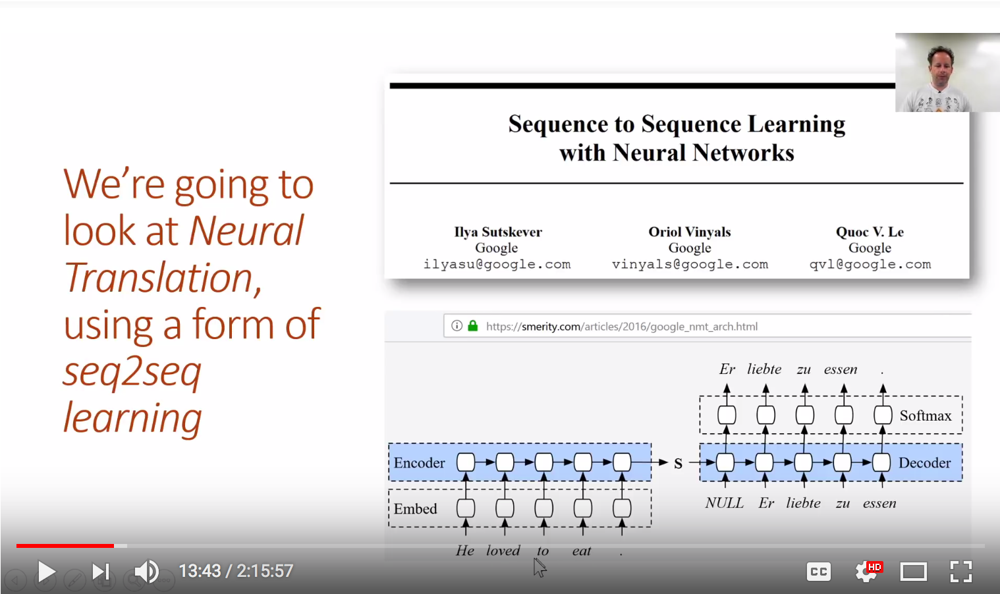
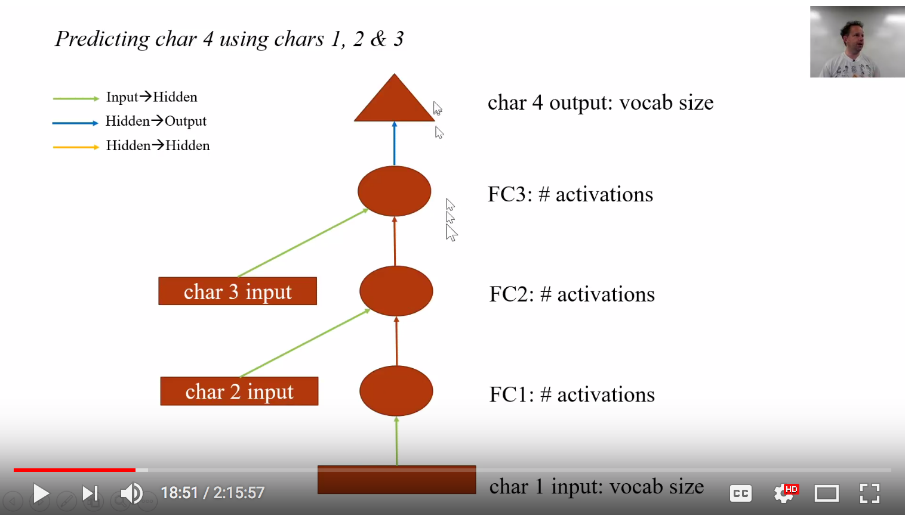
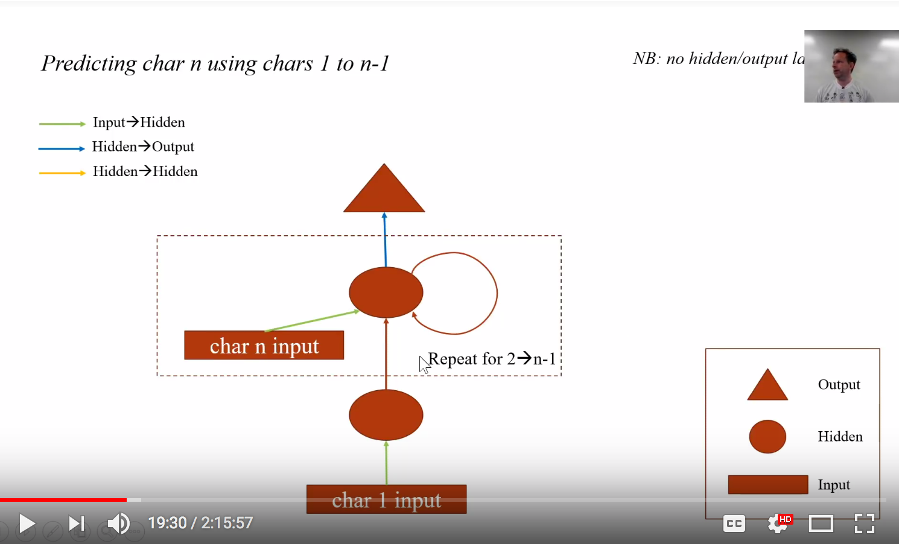
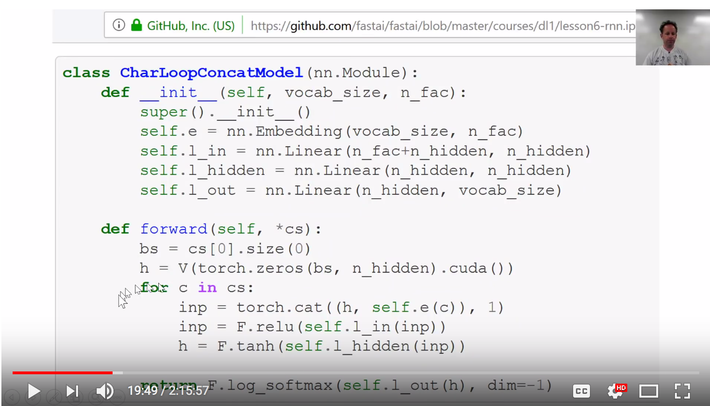
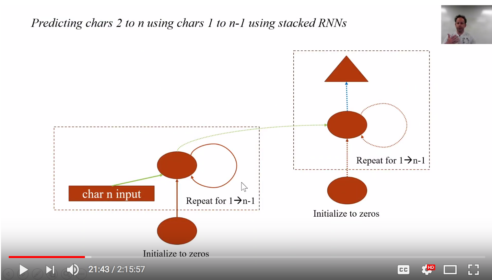
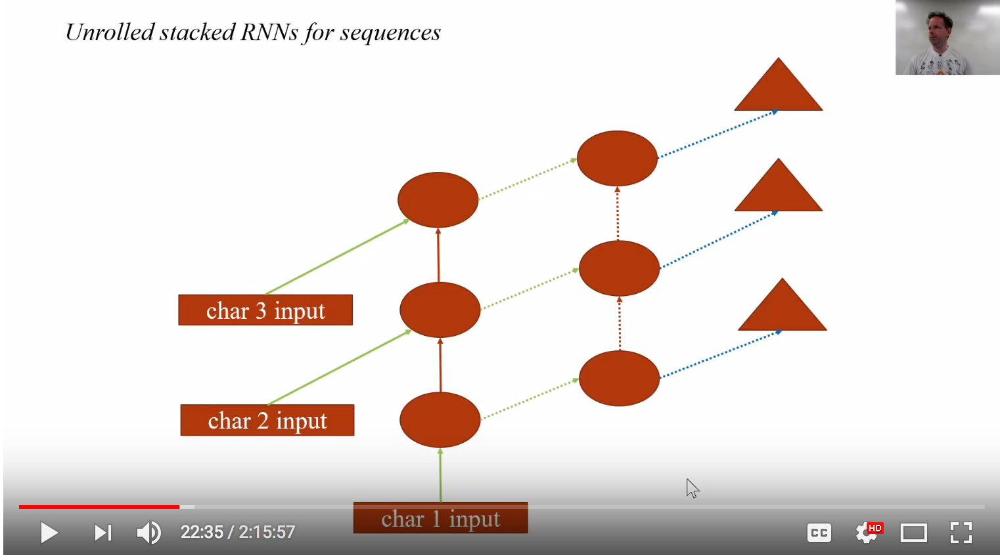

# Lesson 11:  Neural Translation

(09-Apr-2018, live)  

- [Wiki Lesson 11](http://forums.fast.ai/t/part-2-lesson-11-wiki/14699)
- [Video Lesson 11](https://www.youtube.com/watch?v=tY0n9OT5_nA&feature=youtu.be) 
  - video length:  2:15:57
- http://course.fast.ai/lessons/lesson11.html
- Notebook:  
   * [translate.ipynb](https://github.com/fastai/fastai/blob/master/courses/dl2/translate.ipynb)

---
# Lesson Description
Today we’re going to learn to **translate French into English**! To do so, we’ll learn how to add **attention to an LSTM** in order to build a sequence to sequence (seq2seq) model. But before we do, we’ll do a review of some key RNN foundations, since a solid understanding of those will be critical to understanding the rest of this lesson.

A seq2seq model is one where both the input and the output are sequences, and can be of difference lengths. Translation is a good example of a seq2seq task. Because each translated word can correspond to one or more words that could be anywhere in the source sentence, we learn an attention mechanism to figure out which words to focus on at each time step. We’ll also learn about some other tricks to improve seq2seq results, including teacher forcing and bidirectional models.

We finish the lesson by discussing the amazing DeVISE paper, which shows how we can bridge the divide between text and images, using them both in the same model!

---
## `00:00` Leslie Smith: super-convergence work
- I want to start pointing out a couple of mini-cool things that happened this week.  One thing I'm really excited about is we briefly talked about how [Leslie Smith](https://twitter.com/lnsmith613) has a new paper out, and it basically, the paper goes, takes his previous two key papers (1: cyclical learning rates and 2: super convergence) and builds on them with a number of experiments to show how you can achieve super-convergence.  Super-convergence lets you train models 5 times faster than previous, kind of step-wise approaches.  It's not 5 times faster than CLR, but it's faster than CLR as well. And the key is that **super-convergence lets you get up to like massively high learning rates** by somewhere between 1 and 3 which is quite amazing.  
- And so the interesting thing about super-convergence is that it... You actually train at those very high learning rates for quite a large percentage of your epochs, and during that time, the loss doesn't really improve very much.  But the trick is it's doing a lot of searching through the space to find really generalizable areas, it seems. 

### `01:25` Sylvain Gugger: super-convergence work
- We kind of had a lot of what we needed in fastai to achieve this, but we're missing a couple of bits.  And so, **[Sylvain Gugger](https://sgugger.github.io)** has done an amazing job of flushing out the pieces that we are missing and then confirming that he has actually achieved super-convergence on training on [CIFAR-10](https://www.cs.toronto.edu/~kriz/cifar.html).  
- I think this is the first time that this has been done that I've heard of, outside of Leslie Smith himself.
- He (Sylain) has got a great blogpost up there [The 1Cycle Policy](https://sgugger.github.io/the-1cycle-policy.html#the-1cycle-policy), which is what Leslie Smith called this approach.
- And this is actually what 1-cycle looks like [upside down V].  It's a single cyclical learning rate but the key difference here is that the going up bit is the same length as the going-down bit, right.  So you go up really slowly and then at the end, for a tenth of the time, you then have this little bit where you go down even further.  And it's interesting.  Obviously, this is a very easy thing to show, a very easy thing to explain.  Sylvain has added it to fastai under the... temporarily it's called the use CLR beta.  By the time you watch this on the video [MOOC], it will probably be called one-cycle, something like that.
- But, you can use this right now.  So that's one key piece to getting these massively high learning rates, and he shows a number of experiments when you do that.
- A second key piece is that as you do this to the learning rate [upside down V], you do this to the momentum [V shape].  So when the learning rate is low, it's fine to have a high momentum but then when the learning rate gets up really high, your momentum needs to be quite a bit lower.  So, this is also part of what he has added to the library, is this cyclical momentum.  
  - And so with these two things, you can train for about a 1/5th of the number of epochs with a stepwise learning rate schedule.  
  - Then you can drop your weight decay down by about 2 orders of magnitude.  
  - You can often remove most or all of your dropout 
- And so you end up with something that is trained faster and generalizes better.
- And it actually turns out Sylvain got quite a bit better accuracy than Leslie Smith's paper.  His guess, I was pleased to see, is because our data augmentation defaults are better than Leslie's.  I hope that's true.  
- So check that out.

## `03:50` Hamel Husain of GitHub: sequence to sequence models
- Another cool thing... as I just said.. there have been so many cool things this week, I'm just going to pick two.
- [Hamel Husain](https://twitter.com/hamelhusain?lang=en) who works at GitHub.
- [Google created a cool demo of my blog post (based on what I learned in Fast.AI)](http://forums.fast.ai/t/google-created-a-cool-demo-of-my-blog-post-based-on-what-i-learned-in-fast-ai/14680)
- [Kubernetes](https://kubernetes.io) is an open-source system for automating deployment, scaling, and management of containerized applications.
- I just really like this:  there's a fairly new project called [Kubeflow](https://www.kubeflow.org) which is basically TensorFlow for Kubernetes.  Hamel wrote a very nice article about magical sequence to sequence models:  [How To Create Data Products That Are Magical Using Sequence-to-Sequence Models](https://towardsdatascience.com/how-to-create-data-products-that-are-magical-using-sequence-to-sequence-models-703f86a231f8), building data products on that and using Kubernetes to kind of put that into production and so forth. 
- He said the Google Kubeflow team created a demo based on what he wrote earlier this year, directly based on the skills he learned in fastai.  And he will be presenting this technique at KDD. KDD is one of the top academic conferences, so I wanted to share this with folks as a motivation to blog, which I think is a great point.  I don't know anybody who goes out and writes a blog and thinks that, you know, probably none of us really think our blog is actually going to be very good, probably nobody's going to read it... And then when people actually do like it and read it, it's with great surprise.  You just go "oh, that's actually something people were interested to read."
```text
hamelsmuHamel HusainApr 9
The Google Kubeflow team created this cool demo: http://gh-demo.kubeflow.org/118

This is based on what I wrote earlier this year: https://towardsdatascience.com/how-to-create-data-products-that-are-magical-using-sequence-to-sequence-models-703f86a231f884, and is directly based upon the skills I learned in fast.ai.

Also, the unexpected benefits of blogging: I will be presenting this technique at KDD conference this year, and am also working on a tutorial on Kaggle-Learn. I just wanted to share this as a motivation for folks to blog, and also share my excitement with, and say thank you to this class and @jeremy.
```
- So, here is the tool where you can summarize github issues using this tool which is now hosted by Google on the kubeflow.org domain
- live demo link is broken: http://gh-demo.kubeflow.org/
- So, I think that's a great story of getting, you know, if Hamel didn't put his work out there, none of this would have happened and yeah, you can check out his post that made it all happen as well.

## `05:35` Sequence to sequence models, Machine Translation
- so talking of the magic of sequence-to-sequence models, let's build one!
- So, we're going to be specifically working on machine translation.  
- Machine translation is something that's been around for a long time.  But, specifically, we are going to look at an approach called neural translation which is using neural networks for translation.  
- And they didn't know... that wasn't really a thing in any kind of meaningful way until a couple of years ago.  And so, thanks to [Chris Manning](https://twitter.com/chrmanning?lang=en) from Stanford for the next 3 slides.
- [in] 2015, Chris pointed out that neural machine translation first appeared properly and it was pretty crappy compared to the statistical machine translation approaches that use kind of classic, like feature engineering and standard NLP kind of approaches of lots of stemming and fiddling around with word frequencies and n-grams and lots of stuff.
- By a year later, it was better than everything else.  This is on a metric called **BLEU**.  We're not going to discuss the metric because it's not a very good metric, and it's not very interesting, but it's what everybody uses.
- **BLEU** (bilingual evaluation understudy) is an algorithm for evaluating the quality of text which has been machine-translated from one natural language to another. Quality is considered to be the correspondence between a machine's output and that of a human: "the closer a machine translation is to a professional human translation, the better it is" – this is the central idea behind BLEU.[1][2] BLEU was one of the first metrics to claim a high correlation with human judgements of quality,[3][4] and remains one of the most popular automated and inexpensive metrics.
- So, that was the BLEU metric [20] as of the time when Chris did this slide.  As of now, it's up here, it's about 30.
- So, we're kind of seeing machine translation starting down the path that we saw starting computer vision object classification in 2012.  I guess, we just surpassed state-of-the-art, and we are now zipping past it at a great rate.
- It's very unlikely that anybody watching this is actually gonna build a machine translation model because you can go to translate.google.com and use it and it works quite well.
- So, why are we learning about machine translation?  Well, the reason we're learning about machine translation is that the general idea of taking some kind of input like a sentence in French and transforming it into some other kind of output with arbitrary length, such as a sentence in English, is a really useful thing to do.  

#### Applications of seq-to-seq (NLP)
- For example, that thing that we just saw that Hamel...github did... **takes github issues and turns them into summaries.** 
- Other examples is **taking videos and turning them into descriptions.**
- Or taking a... well I don't know, I mean like you know basically anything where you are spitting out kind of an arbitrary sized output, very often that's a sentence.  So maybe taking a CT scan and spitting out a radiology report.  This is where you can use seq-to-seq learning. 

---
### `08:35` 4 Big Wins of Neural MT (Machine Translation) [slide]
#### 1. End-to-end training
All parameters are simultaneously optimized to minimize a loss function on the network's output.

#### 2. Distributed representations share strength
Better exploitation of word and phrase similiarities

#### 3. Better exploitation of context
NMT can use a much bigger context - both source and partial target text - to translate more accurately

#### 4. More fluent text generation
Deep learning text generation is much higher quality

### `08:35` 4 Big Wins of Neural MT (Machine Translation) [class notes]
- So the important thing about a neural machine translation is... more slides from Chris.  And generally, seq-to-seq models is that there is no fussing around with heuristics and hackey feature engineering, whatever.  It's end to end training.  We are able to build these distributed representations which are shared by lots of kinds of concepts within a single network.  We are able to use **Long Term State** in the **RNN** so use a lot more context rather than n-gram kind of approaches.  
- And in the end, the text we are generating uses an RNN as well so we can build something that's more fluid. 

- heuristic definition:  A heuristic technique (/hjʊəˈrɪstɪk/; Ancient Greek: εὑρίσκω, "find" or "discover"), often called simply a heuristic, is any approach to problem solving, learning, or discovery that employs a practical method, not guaranteed to be optimal, perfect, logical, or rational, but instead sufficient for reaching an immediate goal. Where finding an optimal solution is impossible or impractical, heuristic methods can be used to speed up the process of finding a satisfactory solution. 

---
### `09:20` BiLSTMs(+Attn) not just for neural MT [slide]
- Part of speech tagging
- Named entity recognition
- Syntactic parsing (constituency and dependency)
- Reading comprehension
- Question answering
- Text summarization
- ...

#### `09:20` BiLSTMs(+Attn) not just for neural MT [class notes]
- We are going to use a bi-directional LSTM with attention, well, actually we're going to use a bi-directional GRU with attention, but basically the same thing.  So you already know about bi-directional recurrent neural network and **attention** we are going to add on top today.  These general ideas you can use for lots of other things as well as Chris points out on slide [above].

### `09:50` BiLSTMs CODE
- So, let's jump into the code which is in the [translate.ipynb](https://github.com/fastai/fastai/blob/master/courses/dl2/translate.ipynb), funnily enough.  
- And so, we are going to try to translate French into English.  And so the basic idea is that we're going to try and make this look as much like a standard neural network approach as possible.  So we are going to need 3 things.  You will remember the 3 things:  
1.  Data
2.  suitable Architecture
3.  suitable Loss Function

### Data
Once you've got those 3 things, you run `fit` and all things going well, you end up with something that solves your problem.  We generally need (x,y) pairs.  Because we need something we can feed into the loss function and say "I took my x-value which was my French sentence and the loss function says it was meant to generate this English sentence [Fr: x, Eng: y] and then you had your predictions which you would then compare and see how good it is. So, therefore, we need lots of these tuples of French sentences with their equivalent English sentence.  That's called a **parallel corpus**.  Obviously, this is harder to find than a corpus for a language model.  Because for a language model, we just need text in some language which you can basically all, for any living language of which the people who use that language like use computers, there will be a few gigabytes at least of text floating around the internet for you to grab. So building a language model is only challenging corpus wise or, you know, ancient languages.  One of our students is trying to do a Sanskrit one, for example, at the moment.  But that's very rarely a problem.  For translation, there are actually some pretty good parallel corpuses available.  For European languages, the European parliament basically has every sentence in every European language.  Anything that goes through the UN is translated to lots of languages.  

#### French to English Corpus
For French to English, we have a particularly nice thing, which is pretty much any semi-official Canadian website will have a French version and an English version.  So, this chap, Chris Callison Burch did a cool thing which is basically to try to transform French urls into English urls by replace "fr" with "en" and hoping that retrieves the the equivalent document.  And then did that for lots and lots of of websites and ended up creating a huge corpus based on millions of web pages. For French to English, we have this *particularly* nice resource.  

We're going to start out by talking about how to **create the data.**  Then, we'll look at the **architecture.**  Then, we'll look at the **loss function.**

#### Bounding Boxes
For **bounding boxes**, all of the interesting stuff was in the **loss function**, but for **neural translation**, all of the interesting stuff is going to be in the **architecture.**

### `13:15` Translation Files
- So, let's zip through this pretty quickly.  And one of the things I want you to think about particularly is, what are the relationships, the similarities in terms of the tasks we're doing and how we do it between language modeling versus neural translation?
- The basic approach here is we're going to take a sentence.  In this case, the example is English to German. And this slide is from Steven Merity.  We steal everything we can from Steven.  We start with some sentence in English and the first step is to do basically the exact same thing we do in a language model which is to chuck it through an RNN.  Now, with our language model...  Actually, let's not even think of our language model.  Let's start even easier: the classification model.  So, something that turns this sentence ("He loved to eat") into positive or negative sentiment.  We had a decoder, you know something which basically took the RNN output and from our paper we grabbed 3 things:  
  - [refer to "Concat Pooling" notes]
  - We took a **maxpool** over all of the time steps.
  - We took a **meanpool** over all of the time steps
  - And, we took the value of the **RNN** at the **last time step**, stacked all those together and put it through a linear layer.  
- Most people don't do that in most NLP stuff.  This is, I think it's something we invented.  People pretty much use the last time step, so all the stuff we'll be talking about today uses the last time step.  
- We start out by chucking this sentence through an RNN and out of it comes some state, "S", so some state meaning some hidden state, some vector that represents the output of an RNN that has encoded that sentence.  You'll see the word that Steven used here was "Encoder".  We have tended to use the word "backbone".  So when we have talked about adding a custom head to an existing model.  Like, you know, the existing pre-trained imagenet model, for example.  We kind of say that's our backbone and then we stick on top of it some "head" that does the task we want.  In sequence to sequence learning, they use the word **encoder** but it basically is the same thing.  It's some piece of a neural network architecture that takes the input and turns it into some representation which we can then stick a few more layers on top of to grab something out of it such as we did for the classifier where we stuck a linear layer on top over to turn it into a sentiment, positive or negative.  
- So, this time though we have something that's a little bit harder than just creating sentiment which is I want to turn this state not into a positive or negative sentiment, but into a sequence of tokens where that sequence of tokens is the German.  In this case, the German sentence that we want.  
- So, this is sounding more like the language model than the classifier because the language model had multiple tokens.  For every input word there was an output word.  But, the language model was also much easier because the number of tokens in the language model output was the same length as the number of tokens in the language model input.  And not only were they the same length, they exactly matched up.  It's like, after word 1, comes word 2.  After word 2, comes word 3.  And so forth.  But for translating language, you don't necessarily know that the word "he" will be translated as the first word in the output.  And the word "love" will be the second word in the output.  I mean, in this particular case, unfortunately, they are the same, but very often, you know, the subject-object order will be different or there will be some extra words inserted or some pronouns, we need to add some gendered article to it, or whatever. 
- So this is the key issue we're going to have to deal with is the fact that we have an arbitrary length output where the tokens in the output do not correspond to the same order, you know, specific tokens in the input.  
- But the general idea is the same.  
  - Here's an RNN to encode the input
  - turns it into some hidden state "S"
  - And then this is the new thing we're going to learn ("NULL Er liebte zu essen") is generating a sequence output.
- So, we already know "sequence 2+", that's IMDb classifier
- We already know "sequence to equal length sequence" where corresponds to the same items, that's the language model, for example.  But, we don't know yet how to do a general purpose sequence to sequence, so that's the new thing today. 
  
<br>
   
<br>

---

### `18:15` slide:  Predicting char 4 using chars 1, 2, 3
<br>
   
<br>

#### Review of RNN
- Very little of this will make sense unless you really understand Lesson 6 (How an RNN works).
- So if some of this lesson doesn't make sense to you and you find yourself wondering, what does he mean by hidden state exactly? How's that working?  Go back and rewatch Lesson 6 to give you a very quick review.  We learnt that an RNN, at its heart, is a standard fully connected network. So here is one with [count: 1, 2, 3, 4] 4 layers.  It takes an input and puts it through 4 layers but then at the second layer, it can just concatenate in the second input, third layer concatenate in a third input.
- But we actually wrote this in Python as just literally a 4-layer neural network, okay.  So there's nothing else we used other than linear layers and values. We used the same weight matrix every time an input came in.  We used the same matrix every time we went from one of these states to the next.  And that's why these arrows are the same color.  
- `19:30` And so we can redraw that previous thing like this.

<br>
   
<br>

- And so, not only did we re-draw it, but we took the, you know, 4 lines of linear, linear, linear, linear code in PyTorch and we replaced it with the following:

<br>
   
<br>
- so remember, we had something that did exactly the same thing as this, but it just had 4 lines of code saying linear, linear, linear, linear, and we literally replaced it with a for-loop because that's nice to refactor.  So literally, that refactoring, which doesn't change any of the math, any of the ideas, any of the outputs.  That refactoring is an RNN, okay.  Turning a bunch of separate lines of code into a Python format.  And that's how we can draw it.
- We could take the output, so it's not outside of the loop and put it *inside* the loop, like so, right.  And if we do that, we are now going to generate a separate output for every input 
- [back to code slide] So in this case, this particular one here, the hidden state gets replaced each time and we end up just spitting out the final hidden state, so this one is this example [one with output outside of box], but if instead we had something that said you know, `hs.append(h)` and returned h's at the end, that would be this picture, yeah [?one with output inside box].  
- So go back and re-look at that notebook if this is unclear.  The main thing to remember is when we say hidden state, we are referring to a vector, okay.  See here, here's the vector:  `h = V(torch.zeroes(bs, n_hidden).cuda())`.  Now, of course, it's a vector for each thing in the mini-batch, so it's a matrix.  But I'm...generally when I speak about these things, I ignore the mini-batch piece and treat it like a single item.
- So it's just a vector of this length:  `n_hidden`

#### `21:40` [slide] Predicting chars 2 to n using chars 1 to n-1 using stacked RNNs
- We also learnt that you can stack these layers on top of each other so rather than this first RNN spitting out output, they could just spit out inputs into a second RNN.  
- If you are thinking at this point, "I think I understand this, but I'm not quite sure."  If you're anything like that, like me, that means you *don't understand this*.  And the only way you know and that you actually understand it is to go and write this in from scratch in PyTorch or Numpy. And if you can't do that, then you know, you don't understand it.  And you can go back and re-watch Lesson 6 and check out the notebook and copy some of the ideas until you can... it's really important that you can write that from scratch.  It's less than a screen of code, okay.  
- So you want to make sure you can create a 2-layer RNN

<br>
   
<br>

#### `22:35` [slide] Unrolled stacked RNNs for sequences
- And this is what it looks like if you unroll 
<br>
   
<br>

- so that's the goal is to get to a point that we first of all have these XY pairs of sentences and we're going to do French to English
- we're going to start by downloading this dataset.  
- training a translation model takes a long time.  Google's translation model has 8 layers of RNNs stacked on top of each other.  There's no conceptual difference between 8 layers and 2 layers.  It's just like, if you're Google and you have more GPUs or CPUs than you know what to do with, then you are fine doing that.  Whereas in our case, it's pretty likely that the kind of sequence to sequence models we're building are not going to require that level of computation.  So to keep things simple, let's do a cut-down thing where rather than learning how to translate French into English for any sentence, let's learn to to translate French questions into English questions.  And specifically questions that start with "what where which when".  
- [translate.ipynb](https://github.com/fastai/fastai/blob/master/courses/dl2/translate.ipynb)
- So you can see here I've got a regex which looks for things that start with "Wh" and ends with a "?"
- So I just go through the corpus, open up each of the two files, each line is one parallel text, zip them together
- I grab the English question, the French question, and check whether they match the regular expressions, okay
```python
re_eq = re.compile('^(Wh[^?.!]+\?)')
re_fq = re.compile('^([^?.!]+\?)')

lines = ((re_eq.search(eq), re_fq.search(fq)) 
         for eq, fq in zip(open(en_fname, encoding='utf-8'), open(fr_fname, encoding='utf-8')))

qs = [(e.group(), f.group()) for e,f in lines if e and f]
```
- Dump that out as a pickle, so I don't have to do that again 
```python
picklepickle..dumpdump((qsqs,,  ((PATHPATH//'fr-en-qs.pkl''fr-en-qs ).open('wb'))
qs = pickle.load((PATH/'fr-en-qs.pkl').open('rb'))
```
```python
qs[:5], len(qs)
```
- and so we now have ~ 52,000 sentences:  52,331
- here are some examples with...well, sentence pairs, and here are some examples of those sentence pairs
- one nice thing about this is that "what who where" questions tend to be fairly short, which is nice 
- But, I would say the idea that we could learn from scratch with no previous understanding of the idea of language let alone of English or French, that we could create something that could translate from one to the other for any arbitrary question with only 50,000 sentences sounds like a ludicrously difficult thing to ask this to do, right.  So, I will be impressed if we can make any progress whatsoever.  There is very little data to do a very complex exercise.  
```bash
([('What is light ?', 'Qu’est-ce que la lumière?'),
  ('Who are we?', 'Où sommes-nous?'),
  ('Where did we come from?', "D'où venons-nous?"),
  ('What would we do without it?', 'Que ferions-nous sans elle ?'),
  ('What is the absolute location (latitude and longitude) of Badger, Newfoundland and Labrador?',
   'Quelle sont les coordonnées (latitude et longitude) de Badger, à Terre-Neuve-etLabrador?')],
 52331)
```
- So, this `qs` contains the tuples of French and English.  You can use this handy idiom, `en_qs,fr_qs = zip(*qs)`, just pick them apart into a list of English questions and a list of French questions.

#### `25:00` Tokenizing 
-  And then we **tokenize** the English questions and we **tokenize** the French questions.  So remember, that just means **splitting them up** into separate words or word-like things
```python
en_token_tok  ==  TokenizerTokenize .proc_all_mp(partition_by_cores(en_qs))
fr_tok = Tokenizer.proc_all_mp(partition_by_cores(fr_qs), 'fr')
en_tok[0], fr_tok[0]
```
output:  
```bash
(['what', 'is', 'light', '?'],
 ['qu’', 'est', '-ce', 'que', 'la', 'lumière', '?'])
 ```
 - By default, the tokenizer that we have here and remember this is a wrapper around the Spacey tokenizer, which is a fantastic tokenizer.  This wrapper, be default, assumes English.  
 - So to ask for French, you just add an extra parameter.  
 - The first time you do this, you will get an error saying that you don't have the spacy French model installed, and you can google to get the command, something `python -m spacey ...` download French, or something like that, to grab the French model, ok
```python
en_tok = Tokenizer.proc_all_mp(partition_by_cores(en_qs))
fr_tok = Tokenizer.proc_all_mp(partition_by_cores(fr_qs), 'fr')
```
- okay, I don't think any of you are going to have RAM problems here because this is not a particularly big corpus but I know that some of you were trying to train new language models during the week and were having RAM problems.  If you do, it's worth knowing what these functions are actually doing.  
- So, for examples, these ones here, is processing every sentence across multiple processes is what the `mp` means.  
```python
??Tokenizer.proc_all_mp
```
- And remember, fastai code is designed to be pretty easy to read, so 3 or 4 lines of code.  So, here's the 3 lines of code to process all mp, find out how many CPUs you have, divide by 2 because normally with hyper-threading they don't all work in parallel
- Then, in parallel, run this this process function: `Tokenizer.proc_all`
```python
@staticmethod
    def proc_all_mp(ss, lang='en', ncpus = None):
        ncpus = ncpus or num_cpus()//2
        with ProcessPoolExecutor(ncpus) as e:
            return sum(e.map(Tokenizer.proc_all, ss, [lang]*len(ss)), [])
```            
- So, that's going to spit out a whole separate Python process for every CPU you have.  If you have a lot of cores, that's a lot of Python processes. Every one is going to load the whole, you know, all this data in and that can potentially use up all our RAM.  So you could replace that with just `proc_all` rather than `proc_all_mp` to use less RAM.  Or you could just use less cores, so, at the moment, we were calling this function `partition_by_cores(a)` (help: `??partition_by_cores`) which calls `partition` on a list and asks to split it into a number of equal length things according to how many CPUs you have so you could replace that, you know, splitting it into a smaller list and run it on less things.   
```python
def partition_by_cores(a):
    return partition(a, len(a)//num_cpus() + 1)
```
- `27:20` JH:  Yes, Rachel?
- RT:  Was an attention layer tried in the language model, do you think it would be a good idea to try and add one?
- JH:  We haven't learned about attention yet, so let's ask about things we have got to [laughs], not things we haven't.  The short answer is "no, I haven't tried it properly.  Yes, you should try it because it might help.
- In general, there are going to be a lot of things we cover today which, if you've done some sequence to sequence stuff before, you'll want to know about something we haven't covered yet.  I'm going to cover all the sequence to sequence things, ok, so at the end of this if I haven't covered the thing you wanted to know about, please ask me then.  If you ask me before, I'll be answering something based on something that I'm about to teach you.  
- So having tokenized the English and French, you can see how it gets split out and you can see the tokenization for French is quite different looking, because French loves their apostrophes and hyphens and stuff, right.  So, if you try to use an English tokenizer for a French sentence, you're going to get a pretty crappy outcome, So, like I don't find you need to know heaps of NLP ideas to use deep learning for NLP but just some basic stuff like, you know, use the right tokenizer for your language, is important.  And so some of the students this week in our study group have been trying to work, build language models for Chinese instance.  Which, of course, doesn't really have the concept of tokenizer in the same way, so we've been starting to look at it, briefly mentioned last week this google thing called sentence piece which basically splits things into arbitrary sub-word units.  And so when I say tokenize, if you're using a language that doesn't have spaces in, you should probably be checking out sentence piece or some other similar sub-word unit thing instead.  
- And, hopefully in the next week or two, we'll be able to report back with some early results of these experiments with Chinese.


### `29:27` (back to notebook) 
- so have you tokenized it, save that to disk.  and then remember the next step after we create tokens is to turn them into numbers and to turn them into numbers, we have two steps.  The first is to get a list of all of the words that appear and then we turn every word into the index into that list, right. 
- If there are more than 40,000 words that appear, then, let's cut it off there so it doesn't go too crazy.  
- And we insert a few extra tokens for beginning of stream (`_bos_`), padding (`_pad_`), end of stream (`_eos_`) and "unknown" (`_unk_`).
```python
def toks2ids(tok,pre):
    freq = Counter(p for o in tok for p in o)
    itos = [o for o,c in freq.most_common(40000)]
    itos.insert(0, '_bos_')
    itos.insert(1, '_pad_')
    itos.insert(2, '_eos_')
    itos.insert(3, '_unk')
    stoi = collections.defaultdict(lambda: 3, {v:k for k,v in enumerate(itos)})
    ids = np.array([([stoi[o] for o in p] + [2]) for p in tok])
    np.save(TMP_PATH/f'{pre}_ids.npy', ids)
    pickle.dump(itos, open(TMP_PATH/f'{pre}_itos.pkl', 'wb'))
    return ids,itos,stoi
```   
- So, if we try to look up something that wasn't in the 40,000 most common, then we use a `defaultdict` to return "3" which is "unknown".
- So, we can go ahead now and turn every token into an ID by putting it through the `stoi` (string to integer) dictionary we just created.
- `30:20` And at the end of that, let's add the number "2", which is "end of string".  And you'll see like...the code you see here...is the code I write when I am iterating and experimenting.  Because 99% of the code I write I am iterating or experimenting turns out to be totally wrong or stupid or embarrassing and and you don't get to see it. But like there's no point, you know, refactoring that and making it beautiful when I'm writing it.  So, I am kind of wanting you to see all the little shortcuts I have so rather than doing this properly and actually finding... you know, having some constant or something for end of string marker and using it... When I'm prototyping, I just do the easy stuff, you know.  I mean, not *so much* that I end up with broken code, you know, but I don't ... I try to find some mid ground between beautiful code and, you know, code that works.  

#### `31:18` Questions
- RT:  Just heard him mention that we divide number of CPUs by 2.  Because of hyper-threading, we don't get a speed-up using all the hyper-threaded cores.  Is this based on practical experience, or is there some underlying reason why we wouldn't get additional speed-up?
- JH:  Yeah, it's just practical experience, and it's like not all things kind of seem like this, but I definitely noticed with tokenization, hyper-threading seemed to slow things down a little bit.  Also, if I use all the cores, you know, like often I want to do something else at the same time.  Like generally run some interactive notebook and I don't have any spare room to do that.  It's a minor issue... uh, yeah.

### `32:00` 
- So now, for our English and our French we can grab our list of IDs (`en_ids` and `fr_ids`).  And when we do that, of course, we need to make sure that we also store the vocabulary.  There's no point having IDs if we don't know like what the number "5" represents -- there's no point in having a number "5".  So, that's our vocabulary (`en_itos`), it's a string.  And the reverse mapping `en_stoi` that we can use to convert more corpuses in the future.  
```python
en_ids, en_itos, en_stoi = toks2ids(en_tok,'en')
fr_ids, fr_itos, fr_stoi = toks2ids(fr_tok,'fr')
```
- So, just to confirm it is working, we can 
  - go through each ID:  `for o in fr_ids[0]`
  - convert the INT to a string:  `fr_itos[o]`
  - and spit that out and there we have our thing back with an `_eos_` marker at the end:  
      `(['qu’', 'est', '-ce', 'que', 'la', 'lumière', '?', '_eos_'], 17573, 24793)`
  - our English vocab is 17,573 (~17K) and our French vocab is 24,793 (~25K)
  - so, you know, there's not too big... you know, too complex a vocab that you're dealing with, which is nice to know!
```python
[fr_itos[o] for o in fr_ids[0]], len(en_itos), len(fr_itos)
```
output:  
```bash
(['qu’', 'est', '-ce', 'que', 'la', 'lumière', '?', '_eos_'], 17573, 24793)
```

### `32:52` Word Vectors
- So, we spent a lot of time on the forums during the week discussing how pointless word vectors are and how you should stop getting so excited about them.  And we are now going to use them.  Why is that?  Basically, all the stuff we've been learning about using language models and pre-trained proper models rather than pre-trained, you know, linear single layers which is what word vectors are...I think [that] applies equally well sequence-to-sequence.  But, I haven't tried it yet.  I haven't built it yet.  
- So, Sebastian and I are, you know, starting to look at that, and slightly distracted by preparing this class at the moment. But after this class is done.
- So, there's a whole thing, for anybody interested in creating some genuinely new, like highly publishable results, the entire area of sequence-to-sequence with pre-trained language models hasn't been touched yet.  And I strongly believe it's going to be just as good as classifications.
- And if you, you now, work on this, and you get to the point where you have something that's looking exciting and you want help publishing it, you know, I'm very happy to help co-author papers, you know, on stuff that's looking good.  So, you know, feel free to reach out if and when you have some interesting results.  
- `34:15` So at this stage we don't have any of that.  So, we're going to use, you know, very little fastai, actually.  And very little in terms of, kind of, fastai ideas. So we, you know, all we've got is word vectors.  

#### Fast text Word Vectors 
- Anyway, so let's at least use decent word vectors.  So, word2Vec is very old, word vectors.  There are better word vectors now and fast text is a pretty good source of word vectors.  There's hundreds of languages available for them.  You language is likely to be represented.  
- So, to grab them, you can click on this link:  https://fasttext.cc/docs/en/english-vectors.html 
  - download word vectors for a language that you're interested in
  - install the fastText Python library
  - it's not available on [PyPI](https://pypi.org) [The Python Package Index (PyPI) is a repository of software for the Python programming language.]
  - But, here's a handy trick.  If there's a GitHub repo that has like a `setup.py` in it and a `requirements.txt` in it, you can just chuck `git+` at the start and stick that in your `pip install` and it works!   
    - `pip install git+https://github.com/facebookresearch/fastText.git`
  - Like hardly anyone seems to know this and like it never even... like if you go to the [fastText](https://github.com/facebookresearch/fastText) repo, they won't tell you this.  They'll say you have to download it and `cd` into it, and blah, blah, blah.  But you don't.  You can just run that `pip..` command.
- Which you can also use for the fastai library, by the way.  If you want to `pip install` the latest version of fastai, you can totally do this.
- So you got the library.  Import it.  
```python
import fastText as ft
```
- Load the model.  So, here's my English model.  
```python
en_vecs = ft.load_model(str((PATH/'wiki.en.bin')))
```
- and here's my French model.
```python
fr_vecs = ft.load_model(str((PATH/'wiki.fr.bin')))
```
- You'll see there's a text version and a binary version.  The binary version's a bit faster.  We're going to use that.  The text version is also a big buggy.
- And then, I'm going to convert it into a standard Python dictionary to make it a bit easier to work with
  - so this is just going to go through each word `vecd = {w:ft_vecs.get_word_vector(w) for w in ft_vecs.get_words()}` with a dictionary comprehension 
  - and save it as a pickled dictionary `pickle.dump(vecd, open(PATH/f'wiki.{lang}.pkl','wb'))`
```python
def get_vecs(lang, ft_vecs):
    vecd = {w:ft_vecs.get_word_vector(w) for w in ft_vecs.get_words()}
    pickle.dump(vecd, open(PATH/f'wiki.{lang}.pkl','wb'))
    return vecd
```
```python
en_vecd = get_vecs('en', en_vecs)
fr_vecd = get_vecs('fr', fr_vecs)
```
- [load in pickled dictionary]
```python
en_vecd = pickle.load(open(PATH/'wiki.en.pkl','rb'))
fr_vecd = pickle.load(open(PATH/'wiki.fr.pkl','rb'))
```
- So, now we've got our pickled dictionary.  We can go ahead and look up a word.  For example.  `,` [comma] and that will return a vector.  The length of that vector is the dimensionality of this set of word vectors:  `dim_en_vecdim_en_v`
- So in this case we've got 300 dimensional English and French words.  
```python
dim_en_vecdim_en_v  = len(en_vecd[','])
dim_fr_vec = len(fr_vecd[','])
dim_en_vec,dim_fr_vec
```
```bash
(300, 300)
```
- for reasons that you'll see in a moment, I also want to find out what the mean of what my vectors are and the standard deviations of my vectors are.  So, the mean's about 0 and the standard deviation is about 0.3.  So, we'll remember that.  
```python
en_vecs = np.stack(list(en_vecd.values()))
en_vecs.mean(),en_vecs.std()
```
```bash
(0.0075652334, 0.29283327)
```

### `36:45` Model Data
- often, corpuses have a pretty long-tailed distribution of sequence length. And it's the longest sequences that kind of tend to overwhelm how long things take and, you know, how much memory is used and stuff like that.  So, I'm going to grab, you know, in this case, the **99th** to **97th** percentile of the English and French [respectively] and truncate them to that amount.  Originally I was using the 90th percentile, so these are poorly named variables, so apologies for that.      
```python
enlen_90 = int(np.percentile([len(o) for o in en_ids], 99))
frlen_90 = int(np.percentile([len(o) for o in fr_ids], 97))
enlen_90,frlen_90
```
```bash
(29, 33)
```
- OK, so that's just truncating them.  So, we're nearly there.  We've got our tokenized numericalized English and French dataset.  We've got some word vectors.  
- `37:35` So, now we need to get it ready for PyTorch.  So PyTorch expects a dataset object and hopefully by now, you all can tell me that a dataset object requires two things:
  1.  a length
  2.  an indexer
- So, I started out writing this and I was like, ok, I need a seq-to-seq dataset.  And I started out writing it and I thought, ok, we're going to have to pass it our X's and Y's and store them away.  And then my indexer is going to need to return a numpy array of the X's at that point and a numpy array of the Y's at that point, and oh, that's it.
- So, then after I wrote this I realized I haven't really written a seq-to-seq dataset.  I've just written a totally generic dataset so here's like the simplest possible dataset that works for any pair of arrays so it's now poorly named.  It's much more general than a seq-to-seq dataset, but that's what I needed it for.  
- This `A` function, remember we've got `V` for **variables**, `T` for for **tensors**, `A` for **arrays**.
- So this basically goes through each of the things you pass it.  If it's not already a numpy array, it converts it into a numpy array and returns back a tuple of all of the things that you passed it which are now guaranteed to be numpy arrays
- So, that's A, V, T, three very handy functions
```python
class Seq2SeqDataset(Dataset):
    def __init__(self, x, y): 
      self.x,self.y = x,y
    def __getitem__(self, idx): 
      return A(self.x[idx], self.y[idx])
    def __len__(self): 
      return len(self.x)
```
- `39:00` so that's it.  That's our dataset.  So now we need to grab our English and French IDs and get a training set and a validation set.  And so, one of the things which is pretty disappointing about a lot of code out there on the internet is that they don't follow some simple best practices.  For example, if you go to the PyTorch website, they have an example section for seq-to-seq translation.  Their example does *not have* a separate validation set.  I tried it, training according to their settings, and I tested it with their validation set.  It turned out that it *overfit* massively.  So, this is not just a theoretical problem.  The actual PyTorch repo has the actual official sequence to sequence translation example which does not check for overfitting and overfits horribly.  
- Also, it **fails to use mini-batches**, so it actually fails to utilize any of the efficiency of PyTorch whatsoever.
- So, there's a lot of, like even if you find code in the official PyTorch repo, don't assume it's any good at all, right.
- The other thing you'll notice is that everybody were...when they like pretty much every other sequence-to-sequence model I've found in PyTorch anywhere on the internet has clearly copied from that shitty PyTorch repo.  Cause all the same variable names, it has the same problems.  It has the same mistakes.
- Like, another example.  Nearly every PyTorch convolutional neural network I found does not use an **adaptive pooling layer**.  So, in other words, the final layer is always average pool 7, 7, right.  So, they *assume* that the previous layer is 7 by 7, and if you use any other size input, you get an exception.  
- And, therefore, nearly everybody I've spoken to that uses PyTorch thinks that there is a fundamental limitation of CNNs that they are tied to the input size. And **that has not been true since VGG**, right.  So every time we grab a new model, and stick it in the fastai repo, I have to go in, search for "pool" and add "adaptive" to the start and replace the "7" with a "1".
- And now, it works on any sized object, right.  So, just be careful, you know.  It's still early days and, believe it or not, even though most of you have only started in the last year, your deep learning journey, you know quite a lot more about a lot of the more important practical aspects than the vast majority of people that are, like, publishing, and writing stuff in official repos and stuff. So, you kind of need to have a little more self-confidence than you might expect when it comes to reading other's people code.  If you find yourself thinking, "that looks odd", it's not necessarily you.  It *might* well be them.
- `41:50` ok, so yeah I would say like at least 90% of deep learning code that I start looking at turns out to have like, you know, like deathly serious problems that make it completely unusable for anything. 
- And, so, I kind of been telling people that I've been working with recently:  you know, if the repo you're looking at doesn't have a section on it saying "here's the test we did where we got the same results as the paper that this was meant to be implementing", that almost certainly means that they haven't got the same results in the paper they're implementing.  They probably haven't even check, ok.  And if you run it, it definitely won't get those results.  Because it's hard to get things right the first time.  It takes me 12 go's.  You know, it probably takes the normal smarter people than me 6 go's.  But, if they haven't tested it once, it almost certainly won't work.  
- `42:42` ok, so there's our sequence to sequence dataset.  Let's get the training and validation sets.  Here's an easy way to do that.
- [very fast speaking through this part.]
- grab a bunch of random numbers, one for each row of your data:  `np.random.rand(len(en_ids_tr))>0.1`
- see if they are bigger than 0.1 or not.  that gives you a list of BOOLS. 
- index into your array with that list of BOOLS to grab a training set
- index into that array with the opposite of that list of BOOLS to get your validation set.  There's a nice easy way to [do it]. There's lots of ways of doing that.  I just like to do different ways to see a few approaches.
- ok, so now we can create our dataset with our X's and our Y's, French and English.  If you want to translate instead English to French, switch these two around and you're done, ok.  
```python
npnp..randomrandom..seedseed((4242))
 trn_keeptrn_kee  = np.random.rand(len(en_ids_tr))>0.1
en_trn,fr_trn = en_ids_tr[trn_keep],fr_ids_tr[trn_keep]
en_val,fr_val = en_ids_tr[~trn_keep],fr_ids_tr[~trn_keep]
len(en_trn),len(en_val)
```

#### `43:20` Data Loaders
- now we need to create data loaders 
- we can just grab our data loader and pass in our dataset and batch size
- we actually have to transpose the arrays.  I"m not going to go into the details about why.  We can talk about it during the week if you're interested.  But, have a think about why we might need to transpose their orientation.  
- but, there's a few more things I want to do.  One is that since we've already done all the pre-processing, there's no point spawning off multiple workers to do like augmentation or whatever because there's not work to do. So, making `num_workers=1` will save you some time.  
- We have to tell it what our padding index is. That's actually pretty important because what's going to happen is that we've got different length sentences.  And fastai is, I think, pretty much the only library that does this.  Fastai will just automatically stick them together and pad the shorter ones to be so they all end up equal length.  Because, remember that a **tensor has to be rectangular**. 
- In the decoder, in particular, I actually want my padding to be at the end, not at the start. Like, for a classifier, I want the padding at the start because I want that final token to represent the last word of the movie review.  But, in the decoder, as you'll see, it actually is going to work out a bit better to have the padding at the end. So, I say `pre_pad=False`.  
- And then, finally, since we've got sentences of different lengths coming in, and they all have to be put together in a mini-batch to be the same size by padding, we would much prefer that the sentence in a mini-batch are of similar sizes already.  Because otherwise, it's going to be as long as the longest sentence and that's going to end up wasting time and memory.
- So, therefore, I am going to use the sampler tricks that we learnt last time which is the validation set.  We're going to ask it to sort everything by length first.  And then, for the training set, we're going to ask it to randomize the order of things but to roughly make it so that things of simlar length are about in the same spot.  So, we've got our `SortSampler` and our `SortishSampler`.
- And then at that point, we can create a **model data object**.  Remember a model data object really does one thing which is it says, I have a training set and a validation set and an optional test set and sticks them into a single object.  
- `45:55` we also have a `PATH` so that it has somewhere to store temporary files, models, stuff like that, right. 
- So, you know, we're doing... we're not using fastai for very much at all in this example.  Just kind of a *minimal* set to show you like, you know, how to, you know, kind of get your model data objects.  Because in the end, once you've got a model data object, you can then create a **learner** and then you can call **fit**.  
- So, that's kind of like minimal amount of fastai stuff here.  This is a standard PyTorch compatible dataset class (`Seq2SeqDataset(Dataset):`).  This is a standard PyTorch compatible data loader.  Behind the scenes, it's actually using the fastai version because I do need it to do this automatic padding for convenience. So there's a few tweaks in our version that are a bit faster and a bit more convenient.
- The fastai samplers we're using. But, you know, there's not too much going on here.  
- So, now we've got our model data object.  We can basically tick off number 1 (1.  Data , 2. Arch, 3. Loss).  
```python
trn_dl = DataLoader(trn_ds, bs, transpose=True, transpose_y=True, num_workers=1, 
                    pad_idx=1, pre_pad=False, sampler=trn_samp)
val_dl = DataLoader(val_ds, int(bs*1.6), transpose=True, transpose_y=True, num_workers=1, 
                    pad_idx=1, pre_pad=False, sampler=val_samp)
md = ModelData(PATH, trn_dl, val_dl)
```

### `47:00` Initial Model
- So, as I said, most of the work is in the architecture and so the architecture is:  
  - going to take our sequence of tokens. 
  - It's going to spit them in to a encoder or, you know, in kind of computer vision terms what we've been calling a backbone. You know, something that's going to try and turn this into some kind of representation.  So that's just going to be an RNN, okay.
- That's going to spit out the **final hidden state** which for each sentence is just a vector, remember?  It's just a single vector.
- And so that's all going to take... none of this is going to be new. That's all going to be using very direct simple techniques that we've already learnt.  And then, we're going to take that and we're going to spit it into a different RNN which is a decoder and that's going to have some new stuff because we need something that can go through one word at a time.  
- `48:00` And it's going to keep going until it thinks it's finished the sentence.  It doesn't know how long the sentence is going to be ahead of time.  It keeps going until it thinks it's finished the sentence and then it stops and returns a sentence.
- So, let's start with the encoder
- So, in terms of variable naming here, there's basically identical variables for encoder and decoder, well attributes, for encoder and decoder.  The encoder versions have `enc`; the decoder versions have `dec`
- So, for the encoder, here's our embeddings.  And so, like I always try to mention like what the mnemonics are.  You know, rather than writing things out, you know, in too longhand.  So, you know, just remember `enc` is an encoder; `dec` is a decoder; `emb` is embedding. 
- the final thing that comes out is `out`.
- the RNN in this case is a GRU, not an LSTM.
- `49:00` they're nearly the same thing.  So, don't worry about the difference.  You could replace it with an LSTM and you'll get basically the same results.  
- To replace it with an LSTM, simply type `nn.LSTM`, rather than `nn.GRU`
- So, we need to create an embedding layer to take because remember what we're being passed is the index of the words into a vocabulary.  And we want to grab their fastText embedding.  And then, over time, we might want to also fine tune to train that embedding into it.
- So, to create an embedding, we'll call `create_emb` up here, so we'll just say `nn.Embedding`.  So, it's important that you know now how to set the rows and columns for your embedding so the number or rows has to be equal to your vocabulary size.  So each vocabulary item has a word vector.
- And the.. how big is your embedding?  Well, in this case, it was determined by fastText and the fastText embedding size is 300.  So, we have to use size 300 as well.  Otherwise, we can't start out by using their embeddings.  
- `50:10` Now, so what we want to do is... this is initially going to give us a random set of embeddings and so we're going to now go through each one of these and if we find it in fastText, we'll replace it with the fastTest embedding, ok.
- So, again something that you should already know is that a PyTorch module that is learnable has a `weight` attribute.  And the `weight` attribute is a variable.  And that variables have a `data` attribute.  And the `data` attribute is a **tensor**:  `wgts = emb.weight.data`
- `50:45` Now, you'll notice very often today I'm saying, "here is something you should know".  Not so that you think "oh, I don't know that. I'm a bad person", but so that you think "okay, this is a concept that I haven't learnt yet.  And Jeremy thinks I ought to know about and so I've got to write that down and I'm gonna go home and I'm gonna like Google because like this is a normal PyTorch attribute in every single learnable PyTorch module.  This is a normal PyTorch attribute in every single PyTorch variable. And so, if you don't know how to grab the weights out of a module or you don't know how to grab the tensor out of a variable, it's gonna be hard for you to build new things or to debug things or to maintain things or whatever, ok.  
- So, if I say you ought to know this, and you're thinking "I don't know this", don't run away and hide.  Go home and learn the thing.  And if you're having trouble learning the thing because you can't find documentation about it, or you don't understand that documentation.  Or you don't know why Jeremy thought it was important you know it, jump on the forum and say like "please explain this thing.  Here's my best understanding of that thing as I have it at the moment.  Here's the resources I've looked at.  Help fill me in."
- `51:53` and normally, if I respond, it's very likely I will not tell you the answer. But, I will instead give you something... a problem that you could solve that if you solve it, will solve it for you.  Because, I know that way it will be something that you remember. So again, don't be put off if I'm like, okay, you like go read this link, try and summarize that thing.  Tell us what you think.  Like, I'm trying to be helpful, not unhelpful.  And if you're still not following, just come back and say like "I had a look, honestly that link you sent I don't know what I knew that maeans. I wouldn't know where to start, whatever."  Like, I'll keep trying to help you until you fully understand it.  
- `52:22` ok, so now that we've got our weight tensor, we can just go through our vocabulary and we can look up the word in our pre-trained vectors `vecs` and if we find it, we will replace the random weights with that pre-trained vector.  
- `52:50` the random weights have a standard deviation of 1.  Our pre-trained vectors, it turned out, had a standard deviation of about 0.3.  So, again, this is the kind of hackey thing I do when I am prototyping stuff, I just multiply it by 3.  Obviously, by the time you, you know, see the video of this, we will have put all the sequence-to-sequence into the fastai library, you won't find horrible hacks like that in there, we hope.  But, hack away, when you are prototyping.
- Some things won't be in fasttext in which case we'll just keep track of it (`except: miss.append(w)`).  And I've just added this print statement:  ` print(len(miss),miss[5:10])` here just so that I can kind of see what's going... like why am I missing stuff.  Basically, when, you know, I'll probably comment it out when I actually commit this to GitHub.  That's why that's there.  okay.
- So, we create those embeddings, and so when we actually create the sequence-to-sequence RNN, it will print out how many were missed.  And so remember, we had like about 30,000 words, so we're not missing too many.  
```python
defdef  create_embcreate_ (vecs, itos, em_sz):
    emb = nn.Embedding(len(itos), em_sz, padding_idx=1)
    wgts = emb.weight.data
    miss = []
    for i,w in enumerate(itos):
        try: wgts[i] = torch.from_numpy(vecs[w]*3)
        except: miss.append(w)
    print(len(miss),miss[5:10])
    return emb
```
```python
nh,nl = 256,2
```
```python
class Seq2SeqRNN(nn.Module):
    def __init__(self, vecs_enc, itos_enc, em_sz_enc, vecs_dec, itos_dec, em_sz_dec, nh, out_sl, nl=2):
        super().__init__()
        self.nl,self.nh,self.out_sl = nl,nh,out_sl
        self.emb_enc = create_emb(vecs_enc, itos_enc, em_sz_enc)
        self.emb_enc_drop = nn.Dropout(0.15)
        self.gru_enc = nn.GRU(em_sz_enc, nh, num_layers=nl, dropout=0.25)
        self.out_enc = nn.Linear(nh, em_sz_dec, bias=False)
        
        self.emb_dec = create_emb(vecs_dec, itos_dec, em_sz_dec)
        self.gru_dec = nn.GRU(em_sz_dec, em_sz_dec, num_layers=nl, dropout=0.1)
        self.out_drop = nn.Dropout(0.35)
        self.out = nn.Linear(em_sz_dec, len(itos_dec))
        self.out.weight.data = self.emb_dec.weight.data
        
    def forward(self, inp):
        sl,bs = inp.size()
        h = self.initHidden(bs)
        emb = self.emb_enc_drop(self.emb_enc(inp))
        enc_out, h = self.gru_enc(emb, h)
        h = self.out_enc(h)

        dec_inp = V(torch.zeros(bs).long())
        res = []
        for i in range(self.out_sl):
            emb = self.emb_dec(dec_inp).unsqueeze(0)
            outp, h = self.gru_dec(emb, h)
            outp = self.out(self.out_drop(outp[0]))
            res.append(outp)
            dec_inp = V(outp.data.max(1)[1])
            if (dec_inp==1).all(): break
        return torch.stack(res)
    
    def initHidden(self, bs): return V(torch.zeros(self.nl, bs, self.nh))
```    
