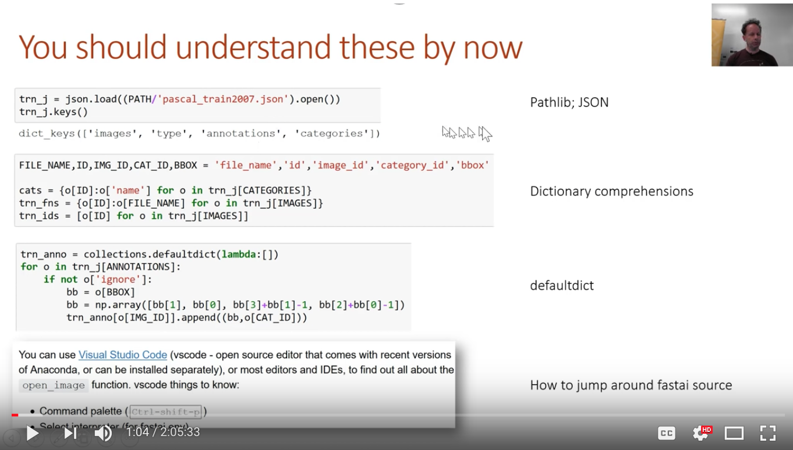
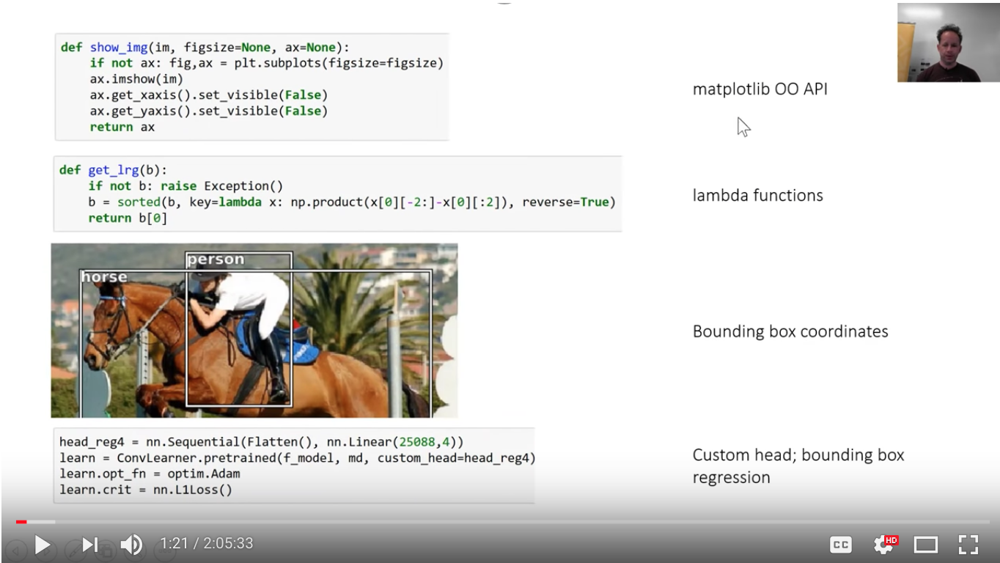
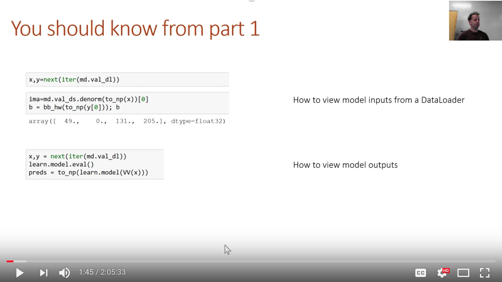
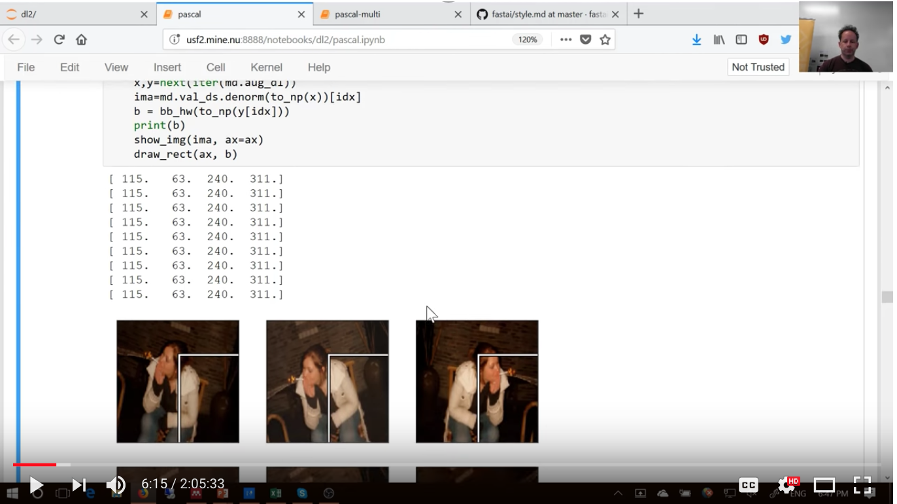
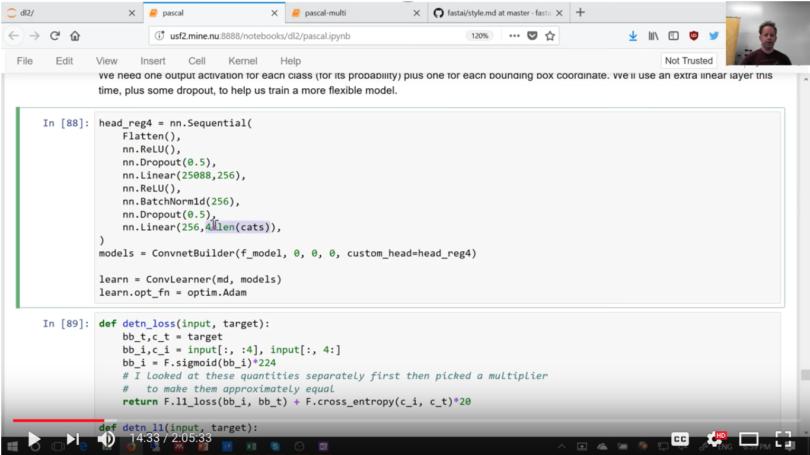

# Lesson 9: Single Shot Multibox Detector (SSD)
(26-Mar-2018, live)  
 
- [Wiki: Part 2 / Lesson 9](http://forums.fast.ai/t/part-2-lesson-9-wiki/14028)
- [Lesson 9 video](https://www.youtube.com/watch?v=0frKXR-2PBY) 
  - video length:  2:05:33
- http://course.fast.ai/lessons/lesson9.html
- Notebook:  
   * [pascal.ipynb](https://github.com/fastai/fastai/blob/master/courses/dl2/pascal.ipynb)
   * [pascal-multi.ipynb](https://github.com/fastai/fastai/blob/master/courses/dl2/pascal-multi.ipynb)

---

## Start Class
- today we will continue working on object detection, which means that for every object in a photo with 1 of 20 classes...
- we are going to figure out what the object is, and what its bounding box is such that we can apply that model to a new dataset with unlabeled data and add those labels to it
- general approach is to start simple and gradually make it more complicated; we started last week with a simple classifier, 3 lines of code, 
- we make it slightly more complex to turn it into a bounding box without a classifier
- today, we will put those two pieces together to make a classifier plus a bounding box 
- all of these are for a single object, the largest object in the image, and from there we will build up something which is closer to our final goal
- you should go back and make sure you understand all the concepts from last week

## Things to Know from Last Week
- Pathlib; JSON
- dictionary comprehensions
- `defaultdict`
- knowing how to jump around fastai source code is important
- lambda functions --> they come up everywhere
- matplotlib API
- Bounding box coordinates
- Custom head; bounding box regression --> will come up in every lesson
<br>
   
<br>
   


## What You Should Know from Part 1 of Course
- How to view model inputs from a DataLoader
- How to view model outputs
- need to know this to learn how to debug models

   


## Today's Lesson (`3:00`)
- we were working through Pascal notebook
- we had gone over creating bounding box over largest object without a classifer
- Jeremy had skipped over augmentations last week

## Augmentations
- data augmentations of `y`, the dependent variable
- before proceeding, Jeremy wants to talk about something awkward `continuous=True` in the statement 
```python
tfmstfms  ==  tfms_from_modeltfms_fro (f_model, sz, crop_type=CropType.NO, tfm_y=TfmType.COORD, aug_tfms=augs)
md = ImageClassifierData.from_csv(PATH, JPEGS, BB_CSV, tfms=tfms,
   bs=bs, continuous=True, val_idxs=val_idxs)
```
- this makes no sense whatsoever because a classifier is a dependent variable as categorical or binomial as opposed to regression which is anything where the dependent variable is continuous
- AND YET, this parameter here, `continuous=True`, says that the dependent variable is continuous
- so this claims to be creating data for a classifier where the dependent is continous;
- this is the kind of awkward rough edge that you see when we're kind of at the edge of the fastai code that is not quite solidified yet
- probably by the time you watch this in the MOOC, it will be sorted out before you even regress it
- Jeremy wanted to point out this issue; sometimes people get confused

### Let's Create Some Data Augmentations (`4:40`)
- normally when we create data augmentations, we tend to type in "transform side on" or "transforms top down"
- file:  [transforms.py](https://github.com/fastai/fastai/blob/master/fastai/transforms.py)
```python
transforms_basic    = [RandomRotate(10), RandomLighting(0.05, 0.05)]
transforms_side_on  = transforms_basic + [RandomFlip()]
transforms_top_down = transforms_basic + [RandomDihedral()]
```
- but, if you look in the transforms.py module, you will see that they are simply defined as a list
- transforms_basic --> is 10 degrees rotation plus 0.05 brightness and contrast
- transforms_side_on --> adds to the basic transform and random horizontal flips
- transforms_top_down --> adds to the basic transform and adds random dihedral group of symmetry which is flips which basically means every possible 90 degree rotation 
- these are ones created by Jeremy; you can always create your own augmentations
```python
augs = [RandomFlip(), 
        RandomRotate(30),
        RandomLighting(0.1,0.1)]
```
- if you are not sure which augmentations are there, you can check the source code, or if you start typing "random" and tab for auto-complete, you will see the options
- let's see what happens if we create some data augmentations
- then, create a model data object; let's go through and re-run the iterator a bunch of times and we all do two things
- we print out the bounding boxes and so you can see the value box is the same each time and we will also draw the pictures 

<br>
   
<br>

- you will see, this lady in the photo has flipped image, contrast is changing, as we would expect
- but you'll see the bounding box is the same each time in the photo and not moving AND is in the WRONG spot
- this is the problem with data augmentation when your dependent variable is pixel values or is in some way connected to your independent variable; the two need to be augmented together
- you can see from the printout that the numbers are bigger than 224 (bounding box coords), but these images are size 224
- the images are not being scaled or cropped
- you can see our dependent variable needs to go through all the same geometric transformations w/o independent variables
- to do that, every transformation has an optional transform `Y` parameter, it takes a transform type `TfmType` 
- `TfmType` has a few options, all of which will be covered in this course
- reminder, hit tab after the `TfmType.` to get options
```python
augsaugs  ==  [[RandomFlipRandomFl (tfm_y=TfmType.COORD),
        RandomRotate(30, tfm_y=TfmType.COORD),
        RandomLighting(0.1,0.1, tfm_y=TfmType.COORD)]
```
- (`7:33`) the `.COORD` option says that the y values represent coordinates, in this case, bounding box coordinates
- therefore, if you flip, you need to change the coordinate to represent that flip or if you rotate, change the coordinate to represent that rotation
- so, I can add transform type coord `tfm_y=TfmType.COORD` to all of my augmentations
- I also have to add the exact same thing to my transforms from model function because that is the thing that does the cropping and/or zooming and padding and/or resizing, and all of those things need to happen to the dependent variable as well
- so, if we add all of those together and rerun this, you'll see the bounding box changes each time with each augmented image
- you'll see the bounding box is in the right spot now
- you'll see sometimes it looks a little odd and the problem is this is just a constraint that the information we have
- the bounding box does not tell us that actually her head isn't way over in the top left corner
- but, actually, if you do a 30 degree rotation if her head was over in the top left corner, then the new bounding box would go really high
- so, this is the correct bounding box based on the information it has available which is to say this is how it might have been
- so, you have to be careful of not doing too high a rotations with bounding boxes because there is not enough information for them to stay totally accurate
- just a fundamental limitation of the information we are given
- if we were doing polygons or segmentations, or whatever else, we wouldn't have this problem
- so, Jeremy is going to a **maximum of 3 degrees** rotation to avoid that problem
- Jeremy is also only going to rotate half the time `p=0.5` 
- here's the set of transformations Jeremy is using:
```python
tfm_ytfm_y  ==  TfmTypeTfmType..COORDCOORD
 augsaugs  ==  [[RandomFlipRandomFl (tfm_y=tfm_y),
        RandomRotate(3, p=0.5, tfm_y=tfm_y),
        RandomLighting(0.05,0.05, tfm_y=tfm_y)]
```

### Custom Head Idea (`09:35`)
- we briefly looked at this custom head idea but basically if you look at `learn.summary()` it does something cool, like runs a small batch of data through a model and prints out how big it is at every layer
- we can see at the end of the convolutional section before we flatten, it is `512 x 7 x 7`
- 512x7x7 = 25,088, rank 3 tensor, if we flatten it out into a single rank=1 tensor (to a vector), it will be 25088 long
- that's why we have this linear:  `nn.Linear(25088, 4)`, there are 4 bounding boxes
```python
learn.summary()
```
```python
Out[170]:
OrderedDict([('Conv2d-1',
              OrderedDict([('input_shape', [-1, 3, 224, 224]),
                           ('output_shape', [-1, 64, 112, 112]),
                           ('trainable', False),
                           ('nb_params', 9408)])),
             ('BatchNorm2d-2',
              OrderedDict([('input_shape', [-1, 64, 112, 112]),
                           ('output_shape', [-1, 64, 112, 112]),
                           ('trainable', False),
                           ('nb_params', 128)])),
             ('ReLU-3',
              OrderedDict([('input_shape', [-1, 64, 112, 112]),
                           ('output_shape', [-1, 64, 112, 112]),
                           ('nb_params', 0)])),
```
- stick that on top of a pretrained resnet
- train it for a while 
```python
head_reg4head_reg4 = nn.Sequential(Flatten(), nn.Linear(25088,4))
learn = ConvLearner.pretrained(f_model, md, custom_head=head_reg4)
learn.opt_fn = optim.Adam
learn.crit = nn.L1Loss()
```

## Single Object Detection
- let's now put those two pieces together so we get something that **classifies** and does **bounding boxes**
- there are 3 things that we need to do to train a neural network ever:
  1.  we need to provide data
  2.  we need to pick some kind of architecture
  3.  loss function - anything that says a lower number here is a better network using this data in this architecture
- we are going to need to create the above 3 things for our classification plus bounding box regression
- that means we need a model data object which has as independent, the images, and as the dependent, I want to have a tuple, first one of the tuples should be the bounding box coordinates, the second element of the tuple should be a class
- there's lots of different ways you can do this
- the particularly lazy and convenient way that Jeremy came up with was to create two mobile data objects, representing the two different dependent variables I want; so one with the bounding box coordinates and one with the classes
- just using the csvs we went over before
- now I am going to merge them together
- so I create a new dataset class
- a dataset class is anything which has a length and and index service or something that lets you use it in square brackets like lists
- in this case, I can have a constructor which takes an existing dataset, so that's going to have both an independent and dependent, and the second dependent that I want is 
- the length, that is obviously just the length of the dataset, the first dataset
- and `getitem` is grab the `X` and the `y` from the dataset that I passed in and return that X and that Y and the i'th value of the second 
- so, there's a dataset that basically adds in 
- as I said, there are lots of ways to do this
```python
class ConcatLblDataset(Dataset):
    def __init__(self, ds, y2): self.ds,self.y2 = ds,y2
    def __len__(self): return len(self.ds)
    
    def __getitem__(self, i):
        x,y = self.ds[i]
        return (x, (y,self.y2[i]))
```
- this is convenient because now I can create a training dataset and a validation dataset
```python
trn_ds2 = ConcatLblDataset(md.trn_ds, md2.trn_y)
val_ds2 = ConcatLblDataset(md.val_ds, md2.val_y)
```
- here's an example
- you can see it's got a couple of the bounding box coordinates in the class
- we can then take the existing training and validation data loaders now so you replace their datasets with these and unknown
```python
val_ds2val_ds2[[00][][11]]
```
```python
(array([   0.,   49.,  205.,  180.], dtype=float32), 14)
```
- we can now test it by grabbing a mini batch of data and checking it so it's ok

### Architecture
- we have the data, now we need an architecture
- the architecture we will use will be the same ones used for the classifier and bounding box regression, but we're going to combine them
- if there are "C" classes, then the number of activations we need in the final layer is:  4+C (4 for coordinates, C probabilities one per class)
- this is the final layer, a linear layer that has 4 plus len of categories:  `nn.Linear(256, 4+len(cats)),`
- the first layer is:  `Flatten()`
- we could just join those together, but, in general, I want my custom head to hopefully be capable of solving the problem I give it on its own, if the pretrained backbone is connected to is appropriate 
- in this case, I am trying to do quite a bit here (in function `head_reg4`), two things: classifer and bounding box regression
- so, just a single linear layer doesn't sound like enough, so Jeremy puts in a second linear layer: `nn.Linear(25088, 256),`
- you can see we do:  nn.ReLU, nn.Dropout, nn.Linear(25088, 256), nn.ReLU, nn.BatchNorm1d, nn.Dropout, nn.Linear
- if you are wondering why there is no `BatchNorm1d1` after the first ReLU, Jeremy checked the ResNet backbone; it already has a BatchNorm as its final layer
- so, this is nearly the same custom head as before, it it's just got 2 linear layers rather than one, and the appropriate non-linearities (such as ReLU)
- that's piece 2; we have got data, we've got architecture, now we need a **Loss Function**

<br>
   
<br>

### Loss Function (`15:30`)
- the loss function needs to look at the **"4+C"** activations and decide, "are they good?"
- are these numbers accurately reflecting the position and the class of the largest object in this image
- we know how to do that 
- for the first 4, we use the **L1 loss**, just like we did in the bounding box regression before
- remember, **L1 loss** is like **Mean Squared Error**, rather than *sum of absolute values* / *sum of absolute values*
- the rest of activations, we can use **cross-entropy loss**
- let's go ahead and do that; we're going to create something called "detection loss"
- loss functions always take an **input** and a **target** --> that's what PyTorch calls them
- input (activations; target (ground truth)
- remember that our custom data set returns a tuple containing the bounding box coordinate and the classes of the target
- so we can destructure that, 
- `bb_i,c_i = input[:, :4], input[:, 4:]` bounding boxes and the input are simply the first 4 elements of the input and the 4 elements onward
- remember we've also got a batch dimension 
- for the bounding boxes, we know they are going to be between 0 and 224 coordinates, because that's how big the images are
- so, let's grab a sigmoid and force it betweeen 0 and 1, and multiply it by 224, and that's just helping our neural net get close to what we know it has to be 
- Q:  as a general rule, is it better to put batch norm before or after ReLU?
- A:  Jeremy suggests that you should put it after a ReLU because batch norm is meant to move towards a 0/ 1 random variable; if you put it after, you're truncating it at 0, so there's no way to create negative numbers, but if you put reLU and then batch norm, it does have that ability
- that way of doing it gives slightly better results; having said that, it's not too big a deal either way, and you'll see during this part of the course most of the time, Jeremy goes ReLU and then batch norm, but sometimes it is batch norm and ReLU if JH is being consistent with a paper
- `bb_i = F.sigmoid(bb_i)*224` so this is to force our data into the right range; if you can do stuff like that, it is easier to train
- Rachel's question:  what's the intuition behind using dropout with p=0.5 after a batch norm? Doesn't batch norm already do a good job of regularizing?
- JH answer:  batch norm does an okay job of regularizing, but if you think back to part 1, we have a list of things to do to avoid overfitting and adding batch norm is one of them, as is data augmentation, but it's perfectly possible that you'll still be ok.  One nice thing about dropout is it has a parameter to say how much to dropout and so that parameters are great; specifically, parameters that decide how much to regularize because it lets you build a nice big overparameterized model and then lets you decide how much to dropout
- JH always tends to use dropout, starts with p=0, and then as he adds parameters, changes the dropout number without worrying about if he saved a model, if he's going to be able to load it back, but if he has dropout layers in one and not another, this way it stays consistent
- moving on, the function calculates the L1 loss and adds the cross entropy
- so that's our loss function, it's surprisingly easy perhaps
- now of course, the L1 loss and the cross entropy may be wildly different scales, in which case the loss function, the larger one is going to dominate
- JH ran the debugger, checked how big each of the two entities were, and found that if we multiply by 20, it makes them about the same scale
```python
def detn_loss(input, target):
    bb_t,c_t = target
    bb_i,c_i = input[:, :4], input[:, 4:]
    bb_i = F.sigmoid(bb_i)*224
    # I looked at these quantities separately first then picked a multiplier
    #   to make them approximately equal
    return F.l1_loss(bb_i, bb_t) + F.cross_entropy(c_i, c_t)*20

def detn_l1(input, target):
    bb_t,_ = target
    bb_i = input[:, :4]
    bb_i = F.sigmoid(bb_i)*224
    return F.l1_loss(V(bb_i),V(bb_t)).data

def detn_acc(input, target):
    _,c_t = target
    c_i = input[:, 4:]
    return accuracy(c_i, c_t)

learn.crit = detn_loss
learn.metrics = [detn_acc, detn_l1]
```

- as you are training, it is nice to print out the information as you go
- JH also grabbed the L1 part and put it in a function and also created a function for accuracy, so he could make the metrics 
- now we have something that is printing out our object detection loss, detection accuracy, and detection L1
- then, train it for a while
- `21:54` it's looking good, a detection accuracy in the low 80's, which is the same as it was before, that is not surprising because ResNet was designed to do classification, so JH wouldn't expect us to be able to improve things in such a simple way but it certainly wasn't designed to do bounding box regression
- it was explicitly actually designed to not care about geometry, rather it takes that last 7x7 grid of activations and averages them all together and throws away all of the information that is going wrong
- you can see that when we only train the last layer, the detection L1 is pretty bad (24.34), and then it improves a lot (18.3)
- whereas the accuracy (0.83) doesn't improve, it stays exactly the same
- interestingly, the L1, when we do accuracy and bounding box at the same time, is 18.55, seems like it is a little bit better, than when we *just do* bounding box regression: 19.92
- if that is counter-intuitive to you, that's one of the main things to think about after this lesson, it is important learning
- the idea is this, figuring out what the main object in an image is, is kind of the hard part, and figuring out exactly where the bounding box should be is and what class it is, is the "easy part", in a way
- `23:45`


### Binary Cross Entropy Loss `1:05:45`
- we don't use cross entropy here, we use **binary cross entropy loss**
- BCE is what we normally use for multi-label classification, like in the planet/satellite competition
- if we have multiple labels, we can't really use **softmax** because softmax encourages one item to have the highest probability
- in our case, each anchor box can have only one item associated with it, it's not for that reason we are avoiding softmax, it's something else
- which is, it is possible for an anchor box to have **nothing** associated with it
- there are 2 ways to handle it:
  1.  can say background is just a class, so let's use softmax and treat background like one of the classes, and softmax can predict it.
      - a lot of people have done it that way; JH doesn't like that because that is a really hard thing to ask a neural network to do
      - it's asking it: can you tell whether this grid cell doesn't have the other 20 objects I am interested in, in it, with a **Jaccard** overlap of > 0.50
      - that's a **really hard** thing to put into a **single computation**
      - on the other hand, what if we just had for each class, is it a motorbike/no, person/no, bird/no, dining table/no, and it can check each of those categories
      - if it is **no to *all* of them**, then it is **background**
  2.  this is JH approach: it's not that we can have multiple true labels, but we can have **zero true labels**
      - we take our target, we do our one-hot embedding, with `num_classes+1`, so at this stage, we do have the idea of **background**
      - but then, we remove the last column `t = V(t[:, :-1].`
      - so now that vector is all zeroes (meaning there is nothing there), or it has at most, one "1"
      - then, we can use binary cross entropy:  `F.binary_cross_entropy_with_logits(x, t, w, size_average=False)/self.num_classes`
      - this method here, is a minor tweak, BUT, it's the kind of minor tweak I want you to think about and understand, because
         a)  it makes a big difference in practice, to your training
         b)  it's the kind of thing you will see a lot of papers talk about, when there is some increment over a previous paper, something like this:  that trying to predict a background category is very difficult, what if we use binary cross entropy instead?
      - if you understand what this is doing and more importantly, why we are doing this, that's a good test of your understanding of the material
      - if you don't understand, that is ok, this shows you that you need to go back and rewatch this part of the video, talk to some of your classmates, ask on the forum so that you understand what we are doing here

#### Section 3.3 reviewing code `1:09:30`
- one hot embedding
- BCE
- there's a custom loss function
- we've got the thing that calculates the Jaccard Index
- the part that converts activations to a bounding box
- part that does map to ground truth

##### SSD Loss Function `1:10:00`
- SSD = Single Shot Multibox Detector
- `def ssd_1_loss(b_c, b_bb, bbox, clas, print_it=False)`
- loops through each image in the mini-batch
- and it calls SSD 1 loss:  `ssd_1_loss` for one image
- so, we destructure our bounding box and class
- `def get_y(bbox, clas)` --> a lot of code you find out there on the internet doesn't work with mini-batches, it only does one thing at a time
- in this case, with this code, it's not exactly a mini-batch.. it's on a whole bunch of ground truth objects at a time and the data loader is being fed a mini-batch at a time to do the convolutional layers
- because we could have different numbers of ground truth objects in each image, but a **tensor** has to be a strict rectangular shape, fastai automatically pads it with zeroes --> anything that is not the same length
- this is something JH fairly recently added
- it is something that is super handy --> almost no other libraries do that
- BUT, that does mean that you then have to make sure that you get rid of the zeroes, right? So, you can see here that I am checking to find all of the non-zeroes, and I'm only keeping those, this is just getting rid of any of the bounding boxes that are just padding
- check that there is an overlap greater than about 0.4 ---> `pos = gt_overlap > 0.4`
- `01:10:30 `
```python
def get_y(bbox,clas):
    bbox = bbox.view(-1,4)/sz
    bb_keep = ((bbox[:,2]-bbox[:,0])>0).nonzero()[:,0]     # check here for non-zeroes
    return bbox[bb_keep],clas[bb_keep]                     # only keeping the non-zero, getting rid of bounding boxes which are padding

def actn_to_bb(actn, anchors):
    actn_bbs = torch.tanh(actn)
    actn_centers = (actn_bbs[:,:2]/2 * grid_sizes) + anchors[:,:2]
    actn_hw = (actn_bbs[:,2:]/2+1) * anchors[:,2:]
    return hw2corners(actn_centers, actn_hw)

def map_to_ground_truth(overlaps, print_it=False):
    prior_overlap, prior_idx = overlaps.max(1)
    if print_it: print(prior_overlap)
#     pdb.set_trace()
    gt_overlap, gt_idx = overlaps.max(0)
    gt_overlap[prior_idx] = 1.99
    for i,o in enumerate(prior_idx): gt_idx[o] = i
    return gt_overlap,gt_idx

def ssd_1_loss(b_c,b_bb,bbox,clas,print_it=False):
    bbox,clas = get_y(bbox,clas)                                   # get rid of the padding
    a_ic = actn_to_bb(b_bb, anchors)                               # turn on the activations
    overlaps = jaccard(bbox.data, anchor_cnr.data)                 # do the Jaccardi
    gt_overlap,gt_idx = map_to_ground_truth(overlaps,print_it)     # do map to ground truth
    gt_clas = clas[gt_idx]
    pos = gt_overlap > 0.4                                         # ck there is an overlap ~ 0.4 (diff papers use diff values)
    pos_idx = torch.nonzero(pos)[:,0]                              # find the things that match
    gt_clas[1-pos] = len(id2cat)                                   # put the background class for those
    gt_bbox = bbox[gt_idx]
    loc_loss = ((a_ic[pos_idx] - gt_bbox[pos_idx]).abs()).mean()   # get the L1 loss with the localization part 
    clas_loss  = loss_f(b_c, gt_clas)                              # get the binary cross entropy for the classification part
    return loc_loss, clas_loss                                     # return the two pieces (localization + classification)

def ssd_loss(pred,targ,print_it=False):
    lcs,lls = 0.,0.
    for b_c,b_bb,bbox,clas in zip(*pred,*targ):
        loc_loss,clas_loss = ssd_1_loss(b_c,b_bb,bbox,clas,print_it)
        lls += loc_loss
        lcs += clas_loss
    if print_it: print(f'loc: {lls.data[0]}, clas: {lcs.data[0]}')
    return lls+lcs                                                 # finally, add them together
```
- that's a lot going on, and it may take a few watches of the video to fully understand it
- the basic idea now is we have the things we need:  data, the architecture and the loss function
- now that we've got those 3 things, we can **train!**
```python
learn.crit = ssd_loss
lr = 3e-3
lrs = np.array([lr/100, lr/10, lr])
```
- learning rate finder, train for a bit, we get down to 25. (training & validation loss)
- we can then see the images with LOTS of bounding boxes on them
- it isn't quite what we want, but it is on the right track
- all of our anchor boxes were small, they were 4x4
- so, to go from *here* to something that will be more accurate, all we will do is create way more ancho boxes

### Anchor Boxes  `01:14:00`
- Q from student:  confused, how are the bounding boxes and the anchor boxes not the same?
  - A from JH:  **anchor boxes** are the fixed, square boxes in the image.  in our example, there were 4x4 = 16 anchor boxes
    - they are in an exact, specific, unmoving location
    - the **bounding boxes** are the ones surrounding an identified image
- `01:14:50` we are going to create lots more anchor boxes!
- there are 3 ways to do that
1. create anchor boxes of different sizes and aspect ratios 
   - here, you can see there is an upright rectangle
   - there is a lying down rectangle (surrounding the bike photo)
   - there's a square
   
- Q:  for the multi-label classification, wny aren't we multiplying the categorical loss by a constant like we did before?
- A:  that's a great question.  because later on, it will turn out that we don't need to
- we have got 3 aspect ratios, at 3 zoom levels (3 squares of different sizes, for each a lying down and upright rectangle)
- that's one way to do this.  And, this is for the 1x1 grid, so in other words, if we added 2 more stratification layers, you eventually get to a 1x1 grid and this is for the 1x1 grid
- another thing we could do is to use more convolutional layers as sources of anchor boxes so ..
- I've randomly gated these a bit, so it's easier to see them
- so, as well as our 16x16 grid cells, we've also got 2x2 grid cells, and we've also got the 1x1 grid cell
- in other words, if we add 3 stride 2 convolutions to the end, we'll have 4x4, 2x2 and 1x1 sets of grid cells, all of which have anchor boxes
- and, for every one of those, we can have all of these different shapes and sizes
- so, obviously those 2 combine with each other to create lots of anchor boxes, and if I try to print that on the screen, it is just one big blur of color
```python
anc_gridsanc_grids = [4,2,1]                    # these are the grid cell sizes
# anc_grids = [2]
anc_zooms = [0.7, 1., 1.3]                      # zoom levels for the anchor boxes
# anc_zooms = [1.]
anc_ratios = [(1.,1.), (1.,0.5), (0.5,1.)]      # aspect ratios 
# anc_ratios = [(1.,1.)]
anchor_scales = [(anz*i,anz*j) for anz in anc_zooms for (i,j) in anc_ratios]
k = len(anchor_scales)
anc_offsets = [1/(o*2) for o in anc_grids]
k
```
- and the rest of the code creates the top right and bottom corners
- and the anchor corner and the middle and height width 
- you can go through the code and print out the anchors, the corners
- `01:18:00` the key is to remember this basic idea that we have a vector of ground truth stuff, where that stuff is sets of 4 bounding boxes
- this is what we were given, it would be in the json files, it's the ground truth, it's the dependent variable
- sets of 4 bounding boxes, and for each one, also a **class**
- so, this is a person in this location, this is a dog in this location, that's the ground truth that we were given
- Q:  just to clarify, each set of 4 is one box?
- A:  yes, exactly, 4 coordinates: top left, top right, bottom left, bottom right
- that's what we printed here, what we called the ground truth.  there's no model, this is what we are told 
- remember, anytime we train a neural net, we have a **dependent variable**, and then we have some **black box neural net**, that takes some **input** and spits out some **output activations**
- we take those activations and we compare them to the ground truth 
- we calculate a loss
- we find the derivative of that and **adjust the weights** according to the **derivative** times a **learning rate**
- the loss is calculated using a loss function
- Rachel:  one of the challenges of this problem and what's going on here is that we're having to come up with an architecture that's letting us predict this ground truth, like it's not because you can have any number of objects in your picture -- it's not immediately obvious, like what's the correct architecture that is going to let us predict that sort of ground truth...
- Jeremy:  I guess so, but I'm going to make this plain as we 


