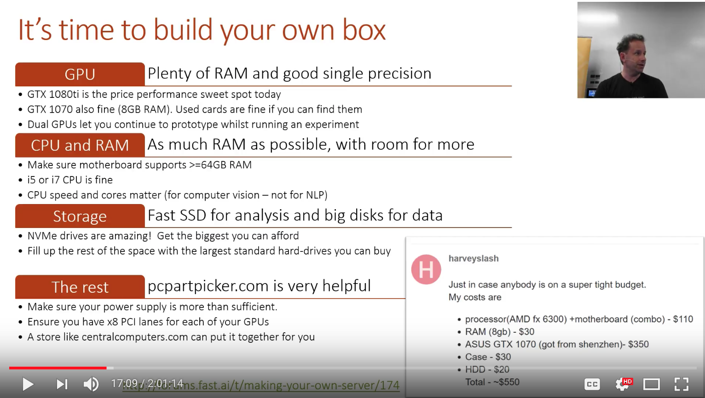
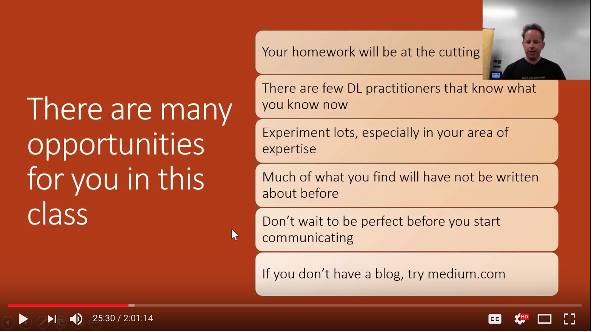

# Lesson 8:  xxx
(19-Mar-2018, live)  
 
[Wiki: Part 2 / Lesson 8](http://forums.fast.ai/t/part-2-lesson-8-in-class/13556)

Notebook:  
*  [pascal.ipynb](https://github.com/fastai/fastai/blob/master/courses/dl2/pascal.ipynb)

---

## Staff
* Intro by [David Uminsky](https://www.usfca.edu/faculty/david-uminsky), Director of Data Institute of USF 
* [Jeremy Howard](https://www.usfca.edu/data-institute/about-us/researchers), Distinguished Scholar in Deep Learning

### Notes
* 600 international fellows around the world
* Rachel & Jeremy will be in room 153, 10am to 6pm each day (not for mentoring, possible projects)

---
## Object Detection
* creating much richer convolutional structures
* what is a picture of and where it is in the picture

## Learning
* Jeremy trying to pick topics that will help us learn foundational topics (richer CNN)
* can't possibly cover hundreds of interesting things done with deep learning

## Park 1 Takeaways
* we don't call this deep learning, but differential programming
* Part 1 was setting up a differential function, a loss function and pressing Go
* If you can configure a loss function that configures score, how good a task is, you're kind of done
* [playground.tensorflow.org](http://playground.tensorflow.org/#activation=tanh&batchSize=10&dataset=circle&regDataset=reg-plane&learningRate=0.03&regularizationRate=0&noise=0&networkShape=4,2&seed=0.71280&showTestData=false&discretize=false&percTrainData=50&x=true&y=true&xTimesY=false&xSquared=false&ySquared=false&cosX=false&sinX=false&cosY=false&sinY=false&collectStats=false&problem=classification&initZero=false&hideText=false)
  * play interactively where you can create and play with your functions manually

## Transfer Learning - definition
Transfer learning or inductive transfer is a research problem in machine learning that focuses on storing knowledge gained while solving one problem and applying it to a different but related problem.[1] For example, knowledge gained while learning to recognize cars could apply when trying to recognize trucks. This area of research bears some relation to the long history of psychological literature on transfer of learning, although formal ties between the two fields are limited.
 

### Transfer Learning
* the most important thing to learn to do to use deep learning effectively
* it makes nearly everything easier, faster and more accurate
* fastai library is all focused on transfer learning
* network that does thing A, remove last layer or so, replace it with a few random layers at the end, fine tune those layers to do thing B, taking advantage of the features the original network learned
   

---

## Embeddings
embeddings allow us to use categorical data
   

## Part 1 to Part 2
* rather than fastai and PyTorch being obscure, will learn enough to understand the source code
* object oriented python important to study and understand
* will introduce Python debugger, using editor to jump to code
* details on coding technique
* detailed walk-throughs of papers
* if you come across something you don't know, it is not hard, it is something you need to learn
* be careful of taking code from online resources, it may just good enough to have run their experiments, but difficult to generalize, be ready to do some debugging

   

## Motivation
* idea is to start with an empty notebook
* don't copy and paste code from notebook; TYPE IT OUT
* make sure you can repeat the process
* practice, practice
* if you don't understand a step, can ask on the forums, propose a hypothesis for why you think it doesn't work

   

## Deep Learning Box
* if you wish, and have financial resources, can build your own deep learning toolbox
* if it is a good time, in your study cycle for it
* budget:  $1000 - $1500 for your own box
* RAM:  try to get 32GB
* PCI Lanes:  don't need to have 16 lanes to feed your GPU, you need 8 lanes
* Build:  you can buy the parts and put it together, or get someplace to do it for you

   

## Reading Papers
* each week we will be reading papers
* in academic papers, people love using Greek letters
* Adam is momentum and momentum on the square of the gradient
* papers include theoretical reasoning for why things work, lot of conferences and journals don't like to accept papers without theoretical justification
* Jeffrey Hinton: a decade or 2 ago, no conferences would accept neural network papers, then 1 abstract theoretical result came out, and journals started accepting neural network research
* we need to learn to read papers
* take a paper, put in effort to understand it, and then write a blog to explain it in code and normal English
* lots of people who do that get a following and great job offers
* understanding papers --->  useful skill
* it's hard to read or understand something that you cannot vocalize, which means if you don't know the names of the Greek letters, it's hard to follow
* spend some time to understand Greek letters

   

## Opportunities in this Class
* cutting edge research, almost no one else knows about 
* write blogs, incorporate research into a library

   
