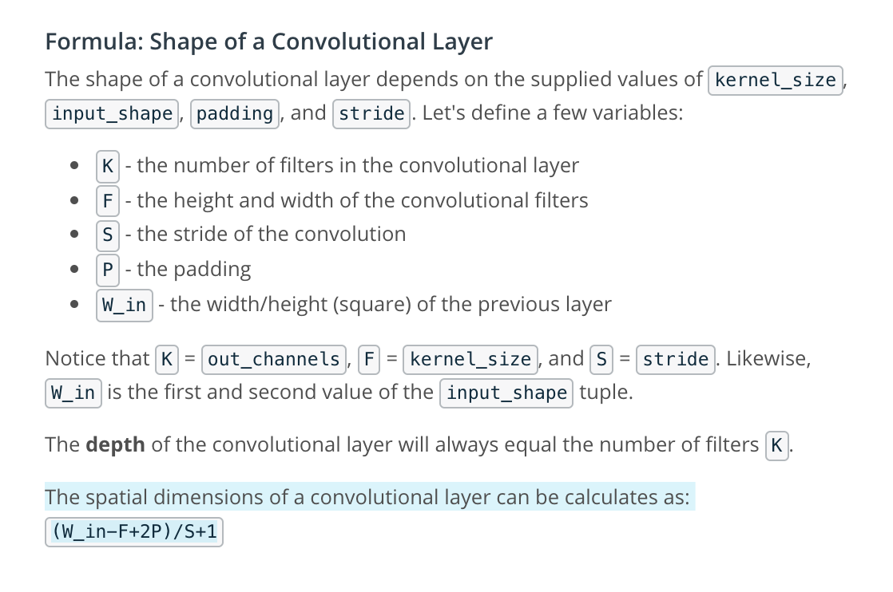

# Convolutional Neural Networks
 

## Normalization
- will help out networks train better
- for the MNIST data, we divide each pixel value by 255.  Our normalized range will be from 0 to 1
- because neural networks rely on gradient calculations, normalizing the pixels helps the gradient calculations stay consistent and not get so large that they slow down or prevent a network from training
- 

## Normalizing image inputs
Data normalization is an important pre-processing step. It ensures that each input (each pixel value, in this case) comes from a standard distribution. That is, the range of pixel values in one input image are the same as the range in another image. This standardization makes our model train and reach a minimum error, faster!

Data normalization is typically done by subtracting the mean (the average of all pixel values) from each pixel, and then dividing the result by the standard deviation of all the pixel values. Sometimes you'll see an approximation here, where we use a mean and standard deviation of 0.5 to center the pixel values. Read more about the [Normalize transformation in PyTorch](https://pytorch.org/docs/stable/torchvision/transforms.html#transforms-on-torch-tensor).

The distribution of such data should resemble a [Gaussian function](http://mathworld.wolfram.com/GaussianFunction.html) centered at zero. For image inputs we need the pixel numbers to be positive, so we often choose to scale the data in a normalized range [0,1].

## MLP = Multi-layer perceptron

### Validation Set: Takeaways
We create a validation set to:  
- Measure how well a model generalizes, during training
- Tell us when to stop training a model; when the validation loss stops decreasing (and especially when the validation loss starts increasing and the training loss is still decreasing)

## MLP vs CNN
### MLP  
- use only fully connected layers
- only accept vectors as input

### CNN
- also use sparsely connected layers
- also accept matrices as input

### openCV Library
OpenCV is a computer vision and machine learning software library that includes many common image analysis algorithms that will help us build custom, intelligent computer vision applications. To start with, this includes tools that help us process images and select areas of interest! The library is widely used in academic and industrial applications; from their site, OpenCV includes an impressive list of users:  
> “Along with well-established companies like Google, Yahoo, Microsoft, Intel, IBM, Sony, Honda, Toyota that employ the library, there are many startups such as Applied Minds, VideoSurf, and Zeitera, that make extensive use of OpenCV.”

So, note, how we `import cv2` in the next notebook and use it to create and apply image filters!

## Define a Convolutional Layer in PyTorch
```python
self.conv1 = nn.Conv2d(depth_of_input, desired_depth_of_output,
    kernel_size, stride = 1, padding = 0)
```

- 3 channels of input:  R, G, B  
- we may want to produce 16 images (or "filters")
- kernel size:  3x3 filter
- stride generally set to 1 (often the default value)
- padding, set it so convolutional layer will have same height and width as previous layer
```python
self.conv1 = nn.Conv2d(3, 16, 3, stride = 1, padding = 0)
```

### Max Pooling
- max pooling follows every 1 or 2 convolutional layers in the sequence
- To define a max pooling layer, you only need to define the filter size and stride.
```python
self.maxpool = nn.MaxPool2d(kernel_size, stride)
```
- most common settings:
```python
self.maxpool = nn.MaxPool2d(2, 2)
```

### Q
- If you want to define a convolutional layer that is the same x-y size as an input array, what padding should you have for a kernel_size of 7? (You may assume that other parameters are left as their default values.)
- padding=3
- Yes! If you overlay a 7x7 kernel so that its center-pixel is at the right-edge of an image, you will have 3 kernel columns that do not overlay anything! So, that's how big your padding needs to be.

## Convolutional Layers
- We typically define a convolutional layer in PyTorch using nn.Conv2d, with the following parameters, specified:
- `nn.Conv2d(in_channels, out_channels, kernel_size, stride=1, padding=0)`
- `in_channels` refers to the depth of an input. For a grayscale image, this depth = 1
- `out_channels` refers to the desired depth of the output, or the number of filtered images you want to get as output
- `kernel_size` is the size of your convolutional kernel (most commonly 3 for a 3x3 kernel)
- `stride` and `padding` have default values, but should be set depending on how large you want your output to be in the spatial dimensions x, y
Read more about Conv2d in the documentation.

## Pooling Layers
- Maxpooling layers commonly come after convolutional layers to shrink the x-y dimensions of an input, read more about pooling layers in PyTorch, here.

## forward
Here, we see that poling layer being applied in the forward function.
```python
x = F.relu(self.conv1(x))
x = self.pool(x)
```


