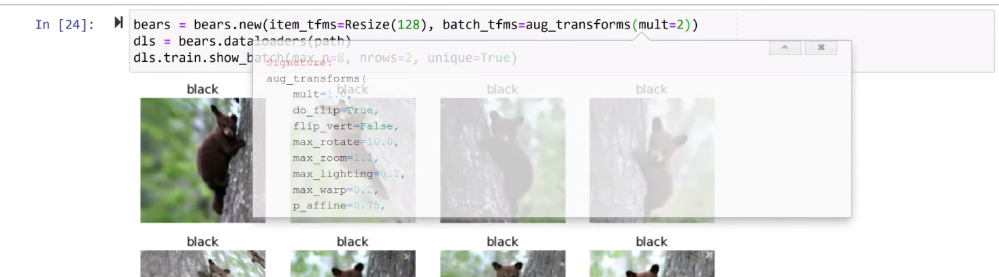

## Referencing Documentation in Jupyter Notebook

#### inside ( of function; shift + tab
Note:  go inside the parenthesis of a functio and hit Shift+Tab to see options



#### `?` OR `??` gives interactive python guide  (abbreviated output below. [full doc output](doc_01_reference.md))

```text
IPython -- An enhanced Interactive Python
=========================================

IPython offers a fully compatible replacement for the standard Python
interpreter, with convenient shell features, special commands, command
history mechanism and output results caching.

At your system command line, type 'ipython -h' to see the command line
options available. This document only describes interactive features.

GETTING HELP
------------

Within IPython you have various way to access help:

  ?         -> Introduction and overview of IPython's features (this screen).
  object?   -> Details about 'object'.
  object??  -> More detailed, verbose information about 'object'.
  %quickref -> Quick reference of all IPython specific syntax and magics.
  help      -> Access Python's own help system.

If you are in terminal IPython you can quit this screen by pressing `q`.
```

####  `?learn` gives (`learn?` works too)
```bash
Signature:   learn(event_name)
Type:        Learner
String form: <fastai2.learner.Learner object at 0x7f5ffb61dfd0>
File:        /opt/conda/envs/fastai/lib/python3.7/site-packages/fastai2/learner.py
Docstring:   Group together a `model`, some `dls` and a `loss_func` to handle training
```

#### `??learn` gives entire class info  (doc abbreviated here); (`learn??` works too)
```bash
Signature:   learn(event_name)
Type:        Learner
String form: <fastai2.learner.Learner object at 0x7f5ffb61dfd0>
File:        /opt/conda/envs/fastai/lib/python3.7/site-packages/fastai2/learner.py
Source:     
class Learner():
    def __init__(self, dls, model, loss_func=None, opt_func=Adam, lr=defaults.lr, splitter=trainable_params, cbs=None,
                 metrics=None, path=None, model_dir='models', wd=None, wd_bn_bias=False, train_bn=True,
                 moms=(0.95,0.85,0.95)):
        store_attr(self, "dls,model,opt_func,lr,splitter,model_dir,wd,wd_bn_bias,train_bn,metrics,moms")
        self.training,self.create_mbar,self.logger,self.opt,self.cbs = False,True,print,None,L()
        if loss_func is None:
            loss_func = getattr(dls.train_ds, 'loss_func', None)
            assert loss_func is not None, "Could not infer loss function from the data, please pass a loss function."
        self.loss_func = loss_func
        self.path = path if path is not None else getattr(dls, 'path', Path('.'))
        self.add_cbs([(cb() if isinstance(cb, type) else cb) for cb in L(defaults.callbacks)+L(cbs)])
        self.model.to(self.dls.device)
        if hasattr(self.model, 'reset'): self.model.reset()
        self.epoch,self.n_epoch,self.loss = 0,1,tensor(0.)

    @property
    def metrics(self): return self._metrics
    @metrics.setter
    def metrics(self,v): self._metrics = L(v).map(mk_metric)
```

#### `?learn.predict` gives:
```bash
Signature: learn.predict(item, rm_type_tfms=None, with_input=False)
Docstring: Return the prediction on `item`, fully decoded, loss function decoded and probabilities
File:      /opt/conda/envs/fastai/lib/python3.7/site-packages/fastai2/learner.py
Type:      method
```

#### `??learn.predict` gives:
```bash
Signature: learn.predict(item, rm_type_tfms=None, with_input=False)
Docstring: Return the prediction on `item`, fully decoded, loss function decoded and probabilities
Source:   
    def predict(self, item, rm_type_tfms=None, with_input=False):
        dl = self.dls.test_dl([item], rm_type_tfms=rm_type_tfms)
        inp,preds,_,dec_preds = self.get_preds(dl=dl, with_input=True, with_decoded=True)
        dec = self.dls.decode_batch((*tuplify(inp),*tuplify(dec_preds)))[0]
        i = getattr(self.dls, 'n_inp', -1)
        dec_inp,dec_targ = map(detuplify, [dec[:i],dec[i:]])
        res = dec_targ,dec_preds[0],preds[0]
        if with_input: res = (dec_inp,) + res
        return res
File:      /opt/conda/envs/fastai/lib/python3.7/site-packages/fastai2/learner.py
Type:      method
```

#### `doc(learn)` gives

```text
Learner object at 0x7f5ffb61dfd0>[source]
Learner object at 0x7f5ffb61dfd0>(event_name)

Group together a model, some dls and a loss_func to handle training
```
#### `doc(learn)` and getting to source code
Can click on "[source]" after typing `doc(learn)` to bring you to the fastai code in GitHub repo

- `doc(learn.predict)` gives
```text
Learner.predict[source]
Learner.predict(item, rm_type_tfms=None, with_input=False)

Return the prediction on item, fully decoded, loss function decoded and probabilities

Show in docs
```

#### `ImageDataLoaders` + <kbd> shift </kbd> + <kbd> tab </kbd> 
```text
Init signature: ImageDataLoaders(*loaders, path='.', device=None)
Docstring:      Basic wrapper around several `DataLoader`s with factory methods for computer vision problems
File:           /opt/conda/envs/fastai/lib/python3.7/site-packages/fastai2/vision/
```


