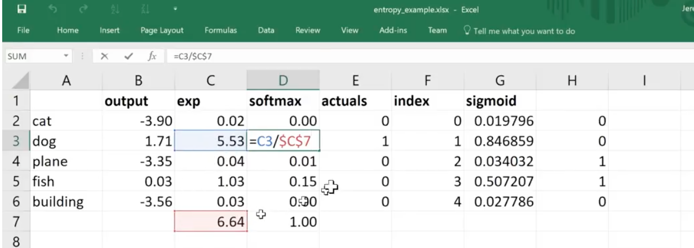

# Lesson 4:  Structured Neural Net Intro, Language RNN Intro, Collaborative Filtering Intro
(20-Nov-2017, live)  

[Livestream: Lesson 4](https://www.youtube.com/watch?v=gbceqO8PpBg&feature=youtu.be)
 
[Wiki: Lesson 4](http://forums.fast.ai/t/wiki-lesson-4/8112)

Notebook:  [lesson3-rossman](https://github.com/fastai/fastai/blob/master/courses/dl1/lesson3-rossman.ipynb)

---

## Blogs to Review
* [Improving the way we work with learning rate](https://techburst.io/improving-the-way-we-work-with-learning-rate-5e99554f163b) Vitaly Bushaev
* [Cyclical Learning Rate Technique](http://teleported.in/posts/cyclic-learning-rate/) Anand Saha
* [Exploring Stochastic Gradient Descent with Restarts (SGDR)](https://medium.com/38th-street-studios/exploring-stochastic-gradient-descent-with-restarts-sgdr-fa206c38a74e) Mark Hoffman (nice intro level)
* [Transfer Learning using differential learning rates](https://towardsdatascience.com/transfer-learning-using-differential-learning-rates-638455797f00) Manikanta Yadunanda
* [Getting Computers To See Better Than Humans](https://medium.com/@ArjunRajkumar/getting-computers-to-see-better-than-humans-346d96634f73) Arjun Rajkumar (technology plus its implications)
* [**Rachel Thomas**:  How (and why) to create a good validation set](http://www.fast.ai/2017/11/13/validation-sets/)

Just jump in and write a technical post.

## Topics to Cover in this Lesson
* Structured neural net info
  - building models on database tables
* Language RNN Intro
  - NLP
* Collaborative Filtering Info
  - recommendation systems

### Focus on this lesson 
- here's the software to do it
- in the next few lessons, we'll get into more details behind scences
- also, we'll look at the details of computer vision

## Dropout
- looking at Kaggle [dog breed competition](https://www.kaggle.com/c/dog-breed-identification)
- 
type learner object, and you can see the layers:  
`learn`  
`Sequential (`
- `(0): BatchNorm1d(1024, eps=1e-05, momentum=0.1, affine=True)` we'll do this later
- `(1): Droput (p = 0.5)` 
- `(2): Linear (1024 -> 512)`  linear layer, matrix multiplier.  1024 rows and 512 columns; take in 1024 activations and spit out 512 activations  
- `(3): ReLU ()`  replace negatives with 0
- `(4): BatchNorm1d(512, eps=1e-05, momentum=0.1, affine=True)` we'll do this later
- `(5): Droput (p = 0.5)`
- `(6): Linear (512 -> 120)` takes 512 activations, puts thru new matrix multiplier (512 x 120), outputs 120
- `(7): LogSoftmax () `  

`)`

      

