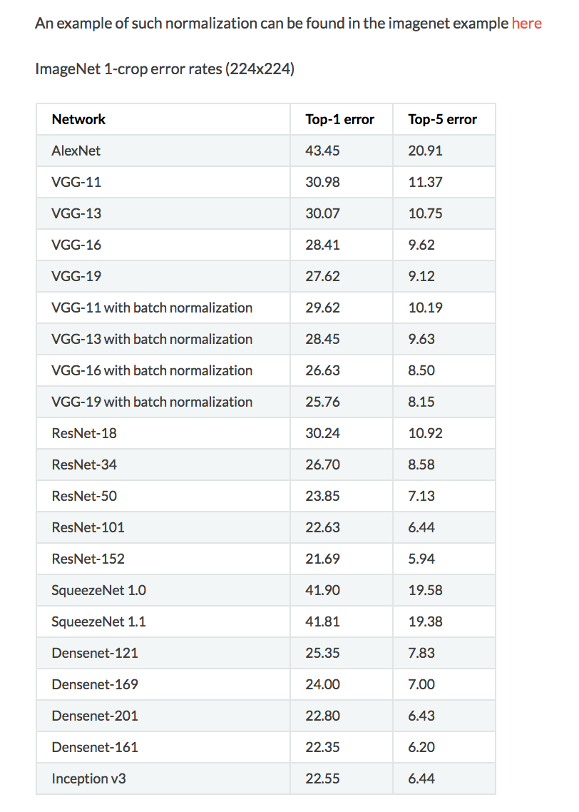

# [ImageNet](http://www.image-net.org)

First step is to use a pre-trained model.

### Pre-trained Model:  
- Someone has already come along, downloaded millions of images off of the internet
- Built a deep learning model that has learned to recognize the contents of those images
- Nearly always, with these pre-trained models, they use ImageNet dataset
- ImageNet has most respected annual computer vision competition (winners are Google, Microsoft)
- 32,000+ categories
- Folks that create these pre-trained networks basically download large subset of images from ImageNet

#### Shortcomings of ImageNet Dataset
ImageNet is carefully curated so that photo has one main item in it

### Using ImageNet
- For us, this is a suitable dataset
- Each year, the winner make source code / weights available

## Architectures: Winners of ImageNet
- **SENet**, 2017 (Squeeze-and-Excitation Networks)
- **ResNet**, 2016 (Microsoft)
- **GoogLeNet**, 2015, Inception module
- **VGG Net**, 2014 (Oxford Univ group)
  - Last of the really powerful simple architectures
  - VGG’s simpler approach is not much less accurate than others
  - For teaching purposes, it is pretty State of the art AND easy to understand
  - Excellent for the problems that differ (like satellite imagery vs simple photos)
- **ZF Net**, 2013 (Matthew Zeiler and Rob Fergus from NYU)
- **AlexNet**, 2012 (Stanford)

## Pre-trained Models
- source:  https://pytorch.org/docs/stable/torchvision/models.html

## Reference
[The 9 Deep Learning Papers You Need To Know About (Understanding CNNs Part 3)](https://adeshpande3.github.io/adeshpande3.github.io/The-9-Deep-Learning-Papers-You-Need-To-Know-About.html) 

