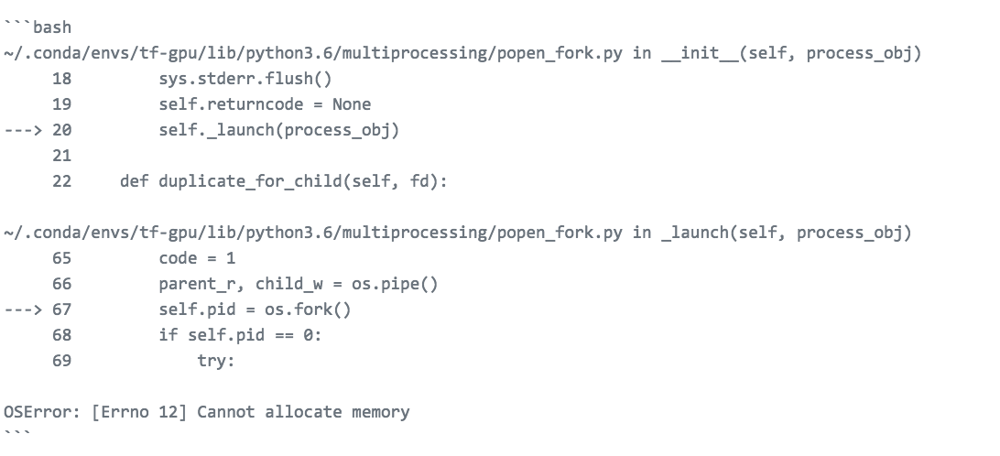

# Fastai FAQs for Beginners

## Q1:  How to ask for help for fastai
- http://forums.fast.ai/t/how-to-ask-for-help/10421
- Make sure you enclose your code in triple back ticks.  Example:  

>use this code - notice the 3 " ` " enclosing the code block:  




>to render this:  

```bash
~/.conda/envs/tf-gpu/lib/python3.6/multiprocessing/popen_fork.py in __init__(self, process_obj)
     18         sys.stderr.flush()
     19         self.returncode = None
---> 20         self._launch(process_obj)
     21 
     22     def duplicate_for_child(self, fd):

~/.conda/envs/tf-gpu/lib/python3.6/multiprocessing/popen_fork.py in _launch(self, process_obj)
     65         code = 1
     66         parent_r, child_w = os.pipe()
---> 67         self.pid = os.fork()
     68         if self.pid == 0:
     69             try:

OSError: [Errno 12] Cannot allocate memory
```


---
## Q2:  Where can I put _my_ Jupter Notebook?

:red_circle: **NOTE:** Do NOT put your Jupyter Notebook under the `/data/` directory!  Here's [the link](http://forums.fast.ai/t/how-to-remove-ipynb-checkpoint/8532/2) for why.

### Option 1 (default):  under /courses
The default location is under the `dl1` folder, wherever you've cloned the repo on your GPU machine.
>my example
```bash
(fastai) paperspace@psgyqmt1m:~$ ls
anaconda3  data  downloads  fastai
```
- Paperspace:  `/home/paperspace/fastai/courses/dl1`
- AWS:         `/home/ubuntu/fastai/courses/dl1`

### Option 2:  where you want
If you change the default **location of your notebook**, you'll need to update your `.bashrc` file.  Add in the path to where you've cloned the fastai GitHub repo:  
- for me, my notebooks are in a "projects" directory:  `~/projects`
- my `fastai` repo is cloned at the root level, so it is here:  `~/fastai`

in the file `.bashrc`  add this path:
```
export PYTHONPATH=$PYTHONPATH:~/fastai
```  
**Reminder:** don't forget to run (or `source`) your `.bashrc` file:  
1.  add path where fastai repo is to `.bashrc`
2.  save and exit
3.  source it:  `source ~/.bashrc`

### Option 3:  used `pip install`
Note that if you did `pip install`, you don't need to specify the path (as in option 2, or you don't need to put in the courses folder, as in option 1).  
However, fastai is still being updated so there is a delay in library being available in pip

---
## Q3:  What does my directory structure look like?
>my path
```bash
PATH = "/home/ubuntu/data/dogscats/"
```

>looking at my directory structure
```bash
!tree {PATH} -d
```
```bash
/home/ubuntu/data/dogscats/
├── models
├── sample
│   ├── models
│   ├── tmp
│   ├── train
│   │   ├── cats
│   │   └── dogs
│   └── valid
│       ├── cats
│       └── dogs
├── test
├── train
│   ├── cats
│   └── dogs
└── valid
    ├── cats
    └── dogs
```
### Notes on directories
* `models` directory:  created automatically
* `sample` directory:  you create this with a small sub-sample, for testing code
* `test` directory:  put any test data there if you have it
* `train`/`test` directory:  you create these and separate the data using your own data sample
* `tmp` directory:  if you have this, it was automatically created after running models
* fastai / keras code automatically picks up the **label** of your categories based on your folders.  Hence, in this example, the two labels are:  dogs, cats

### Notes on image file names
* not important, you can name them whatever you want


>looking at file counts
```bash
# print number of files in each folder

print("training data: cats")
!ls -l {PATH}train/cats | grep ^[^d] | wc -l

print("training data: dogs")
!ls -l {PATH}train/dogs | grep ^[^d] | wc -l

print("validation data: cats")
!ls -l {PATH}valid/cats | grep ^[^d] | wc -l

print("validation data: dogs")
!ls -l {PATH}valid/dogs | grep ^[^d] | wc -l

print("test data")
!ls -l {PATH}test1 | grep ^[^d] | wc -l
```
>my output
```bash
training data: cats
11501
training data: dogs
11501
validation data: cats
1001
validation data: dogs
1001
test data
12501
```
---
## Q4:  What is a good train/validation/test split?
- can do `80/20` (train/validation)
- if you have or are creating a 'test' split, use for (train/validation/test):
    - can do `80/15/5`
    - can do `70/20/10` 
    - can do `60/20/20` 
    
**Note:**  Depending on who the instructor is, they use various naming conventions:  
- train/test and then **validation** for holdout data
- train/validation and then **test** for holdout data

It's important to understand that:  
- in the case of train/test, the test set is used to test for **generalization**
- the **holdout data** is a second test set
    
 


