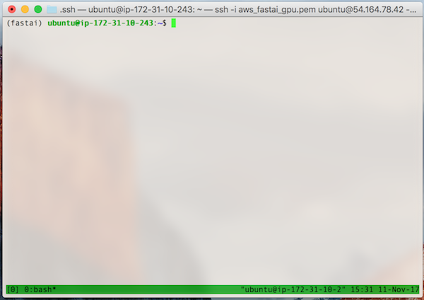
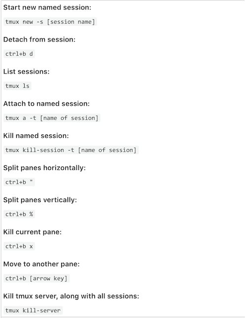

# tmux on AWS

[Part 1.  Background](#section-a)  
[Part 2.  Getting Set Up](#section-b)  
[Part 3.  Using tmux](#section-c)  
[Part 4.  Use tmux, Exit AWS, log back in](#section-d)  
[Part 5.  tmux:  Summary of Primary Commands](#section-e)  


## <a name="section-a"></a>Part 1.  Background


### Purpose
* Lets you tile window panes in a command-line environment.
* This in turn allows you to run, or keep an eye on, multiple programs within one terminal.

### Resource
[Tmux: A Gentle Introduction to tmux](https://hackernoon.com/a-gentle-introduction-to-tmux-8d784c404340) by [Alek Shnayder](https://alekshnayder.com)
* Installation
* Getting In & Getting Out
* Managing Panes
* Custom Themes

---
## <a name="section-b"></a>Part 2.  Getting Set Up

#### Step 1:  A Background
Note 1:  I am using fastai deep learning AMI  
Note 2:  tmux is already installed.  
Note 3:  **On the fastai AWS AMI, tmux mouse mode is enabled, so hold down shift while selecting to copy to your local clipboard.**  
Note 4:  If tmux is not installed, see the Resource above for instructions.

#### Step 2:  Log into AWS Instance
Note 1:  Log into [AWS Console](http://console.aws.amazon.com/ ) and check that instance is running  
Note 2:  Ensure I am in the appropriate directory  

```bash
pwd
/Users/reshamashaikh/.ssh
```
>my syntax for logging in 
```
ssh -i aws_fastai_gpu.pem ubuntu@54.164.78.42 -L8888:localhost:8888   
```
>my example
```bash
ssh -i aws_fastai_gpu.pem ubuntu@54.164.78.42 -L8888:localhost:8888 
The authenticity of host '54.164.78.42 (54.164.78.42)' can't be established.
ECDSA key fingerprint is SHA256:RoHkdmFaS+2/w/9CGncGb4cPO3lUutStxQ7BACCzopI.
Are you sure you want to continue connecting (yes/no)? yes
Warning: Permanently added '54.164.78.42' (ECDSA) to the list of known hosts.
Welcome to Ubuntu 16.04.3 LTS (GNU/Linux 4.4.0-1039-aws x86_64)

 * Documentation:  https://help.ubuntu.com
 * Management:     https://landscape.canonical.com
 * Support:        https://ubuntu.com/advantage

  Get cloud support with Ubuntu Advantage Cloud Guest:
    http://www.ubuntu.com/business/services/cloud

5 packages can be updated.
0 updates are security updates.

(fastai) ubuntu@ip-172-31-10-243:~$ 
```

---

## <a name="section-c"></a>Part 3.  Using tmux

### See what version of tmux is running
```tmux -V```
>my example
```bash
(fastai) ubuntu@ip-172-31-10-243:~$ tmux -V
tmux 2.1
```

### See what tmux sessions are running
```tmux ls```  
>my example
```bash
(fastai) ubuntu@ip-172-31-10-243:~$ tmux ls
error connecting to /tmp/tmux-1000/default (No such file or directory)
```
Note:  right now, I have not tmux sessions running.  


### tmux:  start a tmux session
```tmux```  
Note:  A green bar will appear at the bottom  




### tmux: create a second window (horizontal)
```ctrl+b "```   

### tmux: create a third window (vertical)
```ctrl+b %```  

### tmux:  navigate between windows
```ctrl+b [then arrow up/down/side]```

### tmux:  MAGIC command
```ctrl+b```  
This is the **key** prompt for using tmux.  

### tmux: kill current pane
```ctrl+b  x```  

### tmux: detach session
This will detach the current session and return you to your normal shell.  You can exit AWS with tmux running in background, and ssh into the instance again.  
```ctrl+b  d```  

### tmux:  list sessions from normal shell
```tmux ls```  
```bash
(fastai) ubuntu@ip-172-31-10-243:~$ tmux ls
0: 1 windows (created Sat Nov 11 15:31:41 2017) [159x38]
(fastai) ubuntu@ip-172-31-10-243:~$ 
```

### tmux:  connect back to tmux session from normal shell
```tmux a -t 0```


### tmux: kill tmux server, along will ALL sessions
```tmux kill-server```
>my example
```bash
(fastai) ubuntu@ip-172-31-10-243:~$ tmux ls
0: 1 windows (created Sat Nov 11 15:31:41 2017) [159x38]
(fastai) ubuntu@ip-172-31-10-243:~$ tmux kill-server
(fastai) ubuntu@ip-172-31-10-243:~$ tmux ls
no server running on /tmp/tmux-1000/default
(fastai) ubuntu@ip-172-31-10-243:~$ 
```

---
## <a name="section-d"></a>Part 4.  Use tmux, Exit AWS, log back in

### Start a tmux session on AWS
```tmux ls```  
```tmux```  
```exit```  

```
(fastai) ubuntu@ip-172-31-10-243:~$ tmux ls
no server running on /tmp/tmux-1000/default
(fastai) ubuntu@ip-172-31-10-243:~$ tmux
[detached (from session 0)]
(fastai) ubuntu@ip-172-31-10-243:~$ tmux ls
0: 1 windows (created Sat Nov 11 15:52:31 2017) [159x38]
(fastai) ubuntu@ip-172-31-10-243:~$ 
(fastai) ubuntu@ip-172-31-10-243:~$ exit
logout
Connection to 54.164.78.42 closed.
```

### Log back into AWS & Confirm tmux session is still running
```ssh -i aws_fastai_gpu.pem ubuntu@54.164.78.42 -L8888:localhost:8888```  
```tmux ls```  
```bash
(fastai) ubuntu@ip-172-31-10-243:~$ tmux ls
0: 1 windows (created Sat Nov 11 15:52:31 2017) [159x38]
(fastai) ubuntu@ip-172-31-10-243:~$ 
```
Note:  The tmux session is still running!

---
## <a name="section-e"></a>Part 5.  tmux:  Summary of Primary Commands



