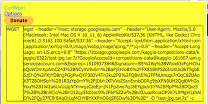

# Browser extensions for getting data

## [Chrome Extension:  CurlWget](https://chrome.google.com/webstore/detail/curlwget/jmocjfidanebdlinpbcdkcmgdifblncg?hl=en)

Note:  This is a second way to download the data from Kaggle. The first way is using `kaggle-cli`.  

## Kaggle Competition
[Planet:  Understanding the Amazon from Space](https://www.kaggle.com/c/planet-understanding-the-amazon-from-space)

The Planet data is here:  
https://www.kaggle.com/c/planet-understanding-the-amazon-from-space/data  
* Download data, and cancel it.
* In Chrome browser, top right, click bright yellow icon and copy the text.  Mine looks like this:  
  

Copy and paste the syntax in your terminal.  
>my example  
```bash
wget --header="Host: storage.googleapis.com" --header="User-Agent: Mozilla/5.0 (Macintosh; Intel Mac OS X 10_11_6) AppleWebKit/537.36 (KHTML, like Gecko) Chrome/61.0.3163.100 Safari/537.36" --header="Accept: text/html,application/xhtml+xml,application/xml;q=0.9,image/webp,image/apng,*/*;q=0.8" --header="Accept-Language: en-US,en;q=0.8" "https://storage.googleapis.com/kaggle-competitions-data/kaggle/6322/test-jpg.tar.7z?GoogleAccessId=competitions-data@kaggle-161607.iam.gserviceaccount.com&Expires=1510937384&Signature=5%2Bq%2BWbix63zFgHiDlusQsWDmXpAmCZ43%2BNCyXV9v6m%2BaPjEHloBX%2FFX858hPSZohUXUs3kT9gbE5zEhQ%2FKjYD8ngPGgPwQYP3IOV4Tn3ku2P2%2FQ8vtE%2FFNUmcqs7rOqC8ZUAoX3TZ8OHSoh%2B1R3zYp0mY%2FjDbhJXPVVsZSsnEynbO0Rg9jsXFN0UH2QgKWhGoYou%2B1W2u6UvUsjgNfYnwgzCzeEjmjN1Fp2we7q18EYgbdv3Y%2BMpP%2BDQxz57%2B%2Bn9Cio%2Bn012qy5hDJec9%2F6PSZ2w%2Bvl0JuazRmaOP2K7L9MgH1zhAlO%2FQy37fC9r8XqOtLqMChYBYKXPHO0qSF6Dw%3D%3D" -O "test-jpg.tar.7z" -c
```
All the cookies, headers needed to download header are saved in the syntax.  Also useful for downloading other items hidden behind a login. 

## Data Location
Option 1:  `data` directory could be a sub-directory of where your Jupyter Notebook is located.  
Option 2:  Use symlinks

## Firefox browser extension
https://addons.mozilla.org/en-US/firefox/addon/cliget/
