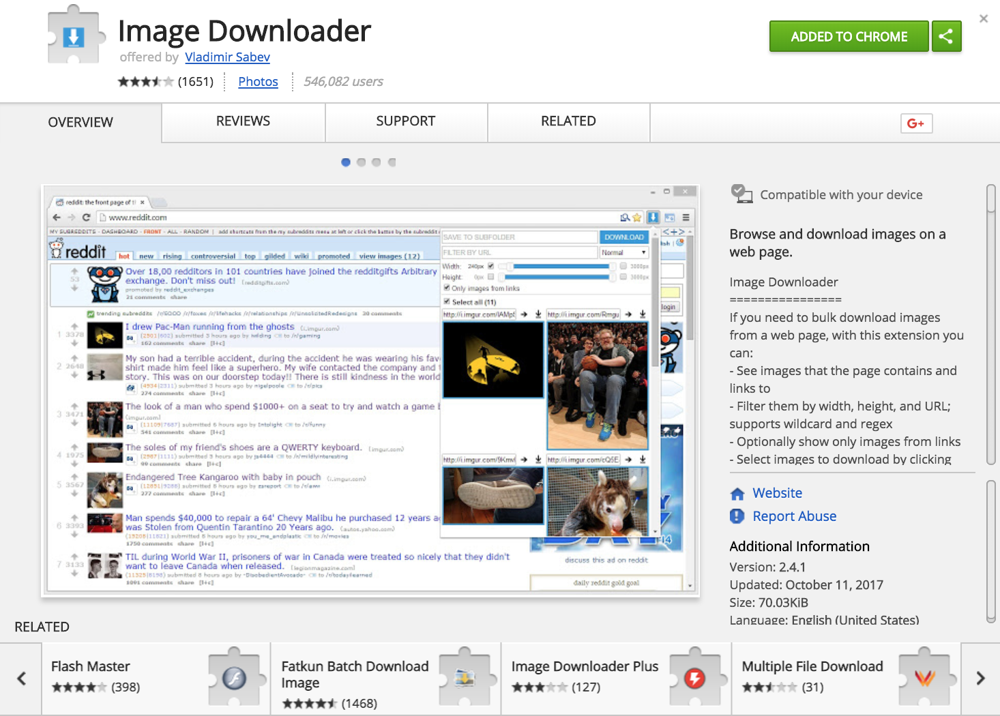

# Getting Image Data

## Data Sources
* [New York Public Library Digital Collections](https://digitalcollections.nypl.org) referred by [Enigma](https://www.enigma.com). 
* Google Images:  https://images.google.com/
* ImageNet:  http://www.image-net.org

## Search for image of interest
- Example:  Search for images of horses

## Downloading Image Data using Chrome Plug in  
- this extension lets you bulk download images from a website
- Use this plugin, Image Downloader which downloads images:  
https://chrome.google.com/webstore/detail/image-downloader/cnpniohnfphhjihaiiggeabnkjhpaldj
- there should be extensions for other browsers such as Firefox, Opera, etc. 

 
 

---
#### My Sample Data
* Horses:  https://digitalcollections.nypl.org/search/index?&keywords=horses&sort=score+desc#/?scroll=150  
* Camels:  https://digitalcollections.nypl.org/search/index?utf8=%E2%9C%93&keywords=camels#/?scroll=180
