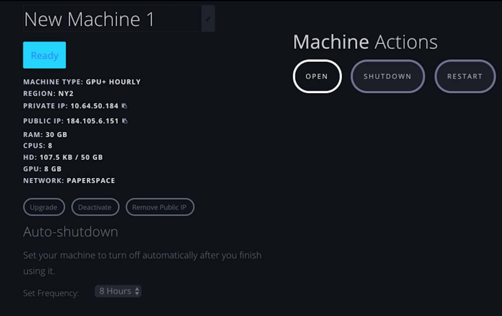

# Paperspace for fast.ai
These notes correspond to first 12 minutes of lesson 1 video  

## About
* Paperspace is a **GPU** accelerated cloud platform
* Paperspace login:  https://www.paperspace.com
  * create account
  * :key: save user name and password somewhere where you can find it
  * click on confirmation email to activate account
* Paperspace runs on their own machines (unlike Crestle, which runs on top of AWS)

## Summary of Charges
- STORAGE:  `250 GB ($7/month)` or `50 GB ($5/month)` 
- USAGE:  `$0.40/hr` (least expensive machine available)
- PUBLIC IP ADDRESS:  `$3/month` (single static IP address)

Note:  There is a **$15 credit code you can all use: FASTAI15**

---
## Part I:  Creating a Machine
### Step 1:  Where to start
- click on this link:  https://www.paperspace.com/console/machines

### Step 2:  Create a new machine
- select green button `New Machine`

### Step 3:  Choose region
- pick a data center
- Regions:  there are 3 regions available
   - West Coast (California)
   - East Coast (New York)
   - Europe
- pick the one closest to you; for me it is East Coast (NYC)

### Step 4:  Choose OS (Operating System)
- Select `Linux Template`
- Select icon for `Ubuntu 16.04`

### Step 5:  Choose machine
- there are various machines with charges noted by the hour
- Paperspace is cheaper than Crestle, with fast machines
- if you choose the $0.65/hr machine, it may ask you to contact Paperspace asking why (anti-fraud step); let them know it is for **fast.ai** and they will get you up and running
- select the `$0.40/hr`, the cheapest one

### Step 6:  Choose storage
- note that you pay for storage as soon as you start the machine up
- :red_circle: don't start and stop a lot of machines, because you'll pay for the **storage cost** for **EACH machine, EACH time**!
- select `250 GB ($7/month)` option; you can also get by with `50 GB ($5/month)` option too

### Step 7:  Options
- turn ON `Public IP` (cost is `$3/month`)
- turn OFF `Auto Snapshot` to save money on doing back-ups

### Step 8:  Payment
- add in a promo code:  **$15 credit code you can all use: FASTAI15**
- add in credit card information (required, even if you have a promo code)

### Step 9:  Create machine
- select `Create your Paperspace` box
- you'll see the new machine "provisioning"
- it takes about a minute
- you'll receive an email with subject *"Your new Paperspace Linux machine is ready"*
  - a temporary password will be included in that email
```text
Your temporary sign-in password for machine New Machine 1 is: *************

You can ssh into your new machine with the following command:ssh paperspace@184.105.6.151

Happy computing!
- The Paperspace Team
```

---
## Part II:  Logging in to Machine
- select the machine in Paperspace
- copy password from email
- paste in terminal
  - Windows: <kbd> Ctrl + Shft + v </kbd>
  - Mac:  <kbd> Cmd + v </kbd>
```bash
Warning: Permanently added '10.64.10.166' (ECDSA) to the list of known hosts.
paperspace@10.64.10.166's password:  
Welcome to Ubuntu 16.04.2 LTS (GNU/Linux 4.4.0-83-generic x86_64)

 * Documentation:  https://help.ubuntu.com
 * Management:     https://landscape.canonical.com
 * Support:        https://ubuntu.com/advantage

paperspace@psnqh1ltz:~$ 
```
This is the current prompt:  
`paperspace@psnqh1ltz:~$ `

---
## Part III:  Configuring the Machine
### Step 1:  `ssh` from local machine
- `ssh` into paperspace machine from your local computer and run the bash file that way.  
>my example
`ssh paperspace@184.105.6.151`  

### Step 2:  run fastai/paperspace bash script
- this will run a script which will set up the CUDA drivers, the special Python distribution Anaconda, libraries, courses & data  
- you can see the list of [bash commands](http://files.fast.ai/setup/paperspace) in the file
- this takes about **1 hour**
```bash
curl http://files.fast.ai/setup/paperspace | bash
```

>my example
```bash
% ssh paperspace@184.105.6.151
The authenticity of host '184.105.6.151 (184.105.6.151)' can't be established.
ECDSA key fingerprint is SHA256:IfjW8JQ/mQWlukNEaFDc5iE2fxwl5mIWaZXhPjKbL/k.
Are you sure you want to continue connecting (yes/no)? yes
Warning: Permanently added '184.105.6.151' (ECDSA) to the list of known hosts.
paperspace@184.105.6.151's password: 
Welcome to Ubuntu 16.04.2 LTS (GNU/Linux 4.4.0-83-generic x86_64)

 * Documentation:  https://help.ubuntu.com
 * Management:     https://landscape.canonical.com
 * Support:        https://ubuntu.com/advantage

Last login: Thu Jan  4 16:44:47 2018 from 192.168.60.13
paperspace@psgyqmt1m:~$ ls
paperspace@psgyqmt1m:~$ curl http://files.fast.ai/setup/paperspace | bash
```

### Step 3:  confirm successful setup
- you'll see this upon a successful set up:
```bash
Requirement already satisfied: wcwidth in /home/paperspace/anaconda3/envs/fastai/lib/python3.6/site-packages (from prompt_toolkit<2.0.0,>=1.0.4->ipython>=4.0.0->ipywidgets)
+ jupyter nbextension enable --py widgetsnbextension --sys-prefix
Enabling notebook extension jupyter-js-widgets/extension...
      - Validating: OK
+ echo

+ echo ---
---
+ echo - YOU NEED TO REBOOT YOUR PAPERSPACE COMPUTER NOW
- YOU NEED TO REBOOT YOUR PAPERSPACE COMPUTER NOW
+ echo ---
---
paperspace@psgyqmt1m:~$ 

```
### Step 4:  reboot Paperspace machine
- when the install is complete, you will have to reboot the Paperspace machine:  select the "refresh" arrow


---
## Part IV:  Logging into Configured Machine
- this is what machine looks like after it has been configured. 
- notice the prompt has changed to `(fastai) paperspace@psnqh1ltz:~$ `

```bash
Warning: Permanently added '10.64.50.184' (ECDSA) to the list of known hosts.
paperspace@10.64.50.184's password: 
Welcome to Ubuntu 16.04.3 LTS (GNU/Linux 4.4.0-104-generic x86_64)

 * Documentation:  https://help.ubuntu.com
 * Management:     https://landscape.canonical.com
 * Support:        https://ubuntu.com/advantage

Last login: Thu Jan  4 16:47:39 2018 from 67.250.186.103
(fastai) paperspace@psgyqmt1m:~$ 
```

### list the files
- <kbd> ls  </kbd> lists all the files
```
(fastai) paperspace@psgyqmt1m:~$ ls
anaconda3  data  downloads  fastai
```

### list the data files
- <kbd> `ls data` </kbd> lists the data contents for first part of this course
```bash
(fastai) paperspace@psgyqmt1m:~$ ls data
dogscats  dogscats.zip
```

### list fastai files
- <kbd> ls fastai </kbd> lists everything for this course
```bash
(fastai) paperspace@psgyqmt1m:~$ ls fastai
CODE-OF-CONDUCT.md  courses  environment.yml  fastai  LICENSE  MANIFEST  MANIFEST.in  README.md  README.rst  requirements.txt  setup.cfg  setup.py  tutorials
(fastai) paperspace@psgyqmt1m:~$
```

## :red_circle: Part V:  Updating fastai repo contents
* :key:  this step is important as having updated content and libraries can bypass errors

### Step 1:  go to directory
<kbd> cd fastai </kbd>  
```
(fastai) paperspace@psnqh1ltz:~$ cd fastai
(fastai) paperspace@psnqh1ltz:~/fastai$ pwd
/home/paperspace/fastai
(fastai) paperspace@psnqh1ltz:~/fastai$
```
### Step 2:  update repo 
<kbd> git pull </kbd>  
- from time to time, you should pull the latest `fastai` repo from GitHub
```bash
(fastai) paperspace@psnqh1ltz:~/fastai$ git pull
Already up-to-date.
```

### Step 3:  update Python / Anaconda libraries
<kbd> conda env update </kbd>  
- do this from time to time (every few weeks)

---
## Part VI:  Paperspace & Jupyter Notebook
### Step 1:  `cd` into fastai directory
- make sure you are here:  `/home/paperspace/fastai`
```bash
(fastai) paperspace@psgyqmt1m:~/fastai$ pwd
/home/paperspace/fastai
(fastai) paperspace@psgyqmt1m:~/fastai$
```

### Step 2:  Launch Jupyter Notebook
<kbd> jupyter notebook </kbd>  
```
(fastai) paperspace@psgyqmt1m:~/fastai$ jupyter notebook
[I 17:16:50.591 NotebookApp] Writing notebook server cookie secret to /run/user/1000/jupyter/notebook_cookie_secret
[W 17:16:51.110 NotebookApp] WARNING: The notebook server is listening on all IP addresses and not using encryption. This is not recommended.
[I 17:16:51.122 NotebookApp] Serving notebooks from local directory: /home/paperspace/fastai
[I 17:16:51.122 NotebookApp] 0 active kernels
[I 17:16:51.122 NotebookApp] The Jupyter Notebook is running at:
[I 17:16:51.122 NotebookApp] http://[all ip addresses on your system]:8888/?token=44cd3335e311c181531f38031095a217b01127d8152aa3fd
[I 17:16:51.122 NotebookApp] Use Control-C to stop this server and shut down all kernels (twice to skip confirmation).
[C 17:16:51.123 NotebookApp] 
    
    Copy/paste this URL into your browser when you connect for the first time,
    to login with a token:
        http://localhost:8888/?token=44cd3335e311c181531f38031095a217b01127d8152aa3fd
```

### Step 3:  Get Notebook url
- copy and paste url into your local browser (example:  Chrome, Firefox, Opera, etc)
- for me it is, and it **WON'T WORK**:   
http://localhost:8888/?token=44cd3335e311c181531f38031095a217b01127d8152aa3fd
- I need to replace "localhost" section with my IP address.  This **DOES WORK**:  
http://184.105.6.151:8888/?token=44cd3335e311c181531f38031095a217b01127d8152aa3fd

:boom:  It works!

---
## Part VII:  Workflow
I opened the [Lesson 1 notebook](https://github.com/fastai/fastai/blob/master/courses/dl1/lesson1.ipynb), made a copy with the name `tmp-reshama-lesson1.ipynb`  

http://184.105.6.151:8888/notebooks/courses/dl1/lesson1.ipynb


---
## :red_circle: Part VIII:  Shutting down Notebook & Machine
### :red_circle: Remember to shut the notebook down and STOP Instance! :moneybag: :red_circle:

- Paperspace has an option where you can choose to automatically shut down your machine at: 1 hr, 8 hrs, 1 day, 1 week
- I chose the `8 hrs` option
- :key: Note that the auto shut down works only for the browser console. **Paperspace will not shut down your server if you SSH to it.**

   


