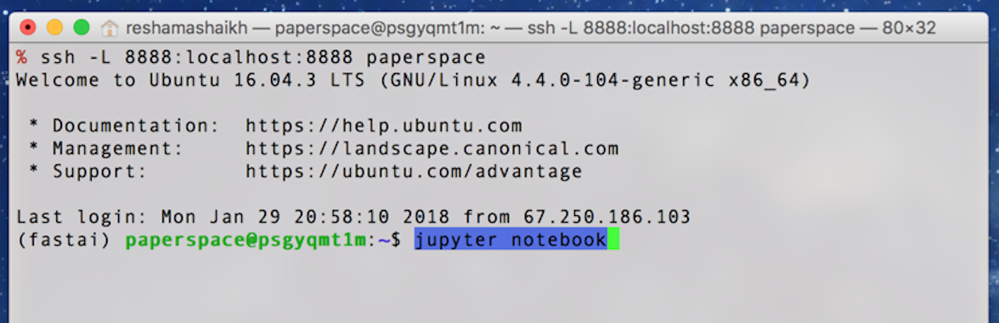

# Paperspace for fast.ai
These notes correspond to first 12 minutes of lesson 1 video.  
**Note:** These notes are more up-to-date and comprehensive than the video.  

## About
* Paperspace is a **GPU** accelerated cloud platform
* Paperspace login:  https://www.paperspace.com
  * create account
  * :key: save user name and password somewhere where you can find it
  * click on confirmation email to activate account
* Paperspace runs on their own machines (unlike Crestle, which runs on top of AWS)

## Summary of Charges
- STORAGE:  `250 GB ($7/month)` or `50 GB ($5/month)` 
- USAGE:  `$0.65/hr` (P5000)
- PUBLIC IP ADDRESS:  `$3/month` (single static IP address)

Note:  There is a **$15 credit code you can use: `FASTAI6GKZ`**.  **This code is only for fastai students.**  

## Paperspace Support
- Technical support, email support@paperspace.com
- Forum thread
  - can post any questions here:  http://forums.fast.ai/t/paperspace-setup-help/9290
  - can ping [@dillon](http://forums.fast.ai/u/dillon/summary)

---
## Part I:  Creating a Machine
### Step 1:  Where to start
- click on this link:  https://www.paperspace.com/console/machines

### Step 2:  Create a new machine
- select green button `New Machine`

### Step 3:  Choose region
- pick a data center
- Regions:  there are 3 regions available
   - West Coast (California)
   - East Coast (New York)
   - Europe
- pick the one closest to you; (for me it is East Coast (NYC));  if a region is unavailable, try another region.  (West Coast may be unavailable for some machines).  

### Step 4:  Choose template
- Select `Public Templates`
- Select icon for `fast.ai`

   


### Step 5:  Choose machine
- there are various machines with charges noted by the hour
- Paperspace is cheaper than Crestle, with fast machines
- if you choose the `$0.65/hr` machine, it may ask you to contact Paperspace asking why (anti-fraud step); let them know it is for **fast.ai** and they will get you up and running
- Machines to choose (whichever you prefer and is available in your region of choice)
  - the **P4000** `$0.40/hr` (cheapest one) 
  - the **P5000** `$0.65/hr`

### Step 6:  Choose storage
- note that you pay for storage as soon as you start the machine up
- select `250 GB ($7/month)` option; you can also get by with `50 GB ($5/month)` option too
- storage costs are pro-rated (like compute (or "usage") costs) 

### Step 7:  Options
- turn ON `Public IP` (cost is `$3/month`)
- turn OFF `Auto Snapshot` (to save money on doing back-ups)

### Step 8:  Payment
- add in promo code
- add in credit card information (required, even if you have a promo code)

### Step 9:  Create machine
- select `Create your Paperspace` box
- you'll see the new machine "provisioning"
- It will take several hours (4-5 hrs) to receive the confirmation email from Paperspace due to high demand
- you'll receive an email with subject *"Your new Paperspace Linux machine is ready"*
  - a temporary password will be included in that email
```text
Your temporary sign-in password for machine New Machine 1 is: *************

You can ssh into your new machine with the following command:ssh paperspace@184.105.2.222

Happy computing!
- The Paperspace Team
```

---
## Part II:  Logging into Paperspace Fastami Image Machine
- select the machine in Paperspace
- copy password from email
- paste in terminal
  - Windows: <kbd> Ctrl + Shft + v </kbd>
  - Mac:  <kbd> Cmd + v </kbd>
- notice the prompt `(fastai) paperspace@psnqh1ltz:~$ `

```bash
Warning: Permanently added '10.64.22.222' (ECDSA) to the list of known hosts.
paperspace@10.64.50.184's password: 
Welcome to Ubuntu 16.04.3 LTS (GNU/Linux 4.4.0-104-generic x86_64)

 * Documentation:  https://help.ubuntu.com
 * Management:     https://landscape.canonical.com
 * Support:        https://ubuntu.com/advantage

Last login: Thu Jan  4 16:47:39 2018 from 67.250.186.103
(fastai) paperspace@psgyqmt1m:~$ 
```

### list the files
- <kbd> ls  </kbd> lists all the files
```
(fastai) paperspace@psgyqmt1m:~$ ls
anaconda3  data  downloads  fastai
```

### list the data files
- <kbd> `ls data` </kbd> lists the data contents for first part of this course
```bash
(fastai) paperspace@psgyqmt1m:~$ ls data
dogscats  dogscats.zip
```

### list fastai files
- <kbd> ls fastai </kbd> lists everything for this course
```bash
(fastai) paperspace@psgyqmt1m:~$ ls fastai
CODE-OF-CONDUCT.md  courses  environment.yml  fastai  LICENSE  MANIFEST  MANIFEST.in  README.md  README.rst  requirements.txt  setup.cfg  setup.py  tutorials
(fastai) paperspace@psgyqmt1m:~$
```

## :red_circle: Part III:  Updating fastai repo contents
* :key:  this step is important as having updated content and libraries can bypass errors

### Step 1:  go to directory
<kbd> cd fastai </kbd>  
```
(fastai) paperspace@psnqh1ltz:~$ cd fastai
(fastai) paperspace@psnqh1ltz:~/fastai$ pwd
/home/paperspace/fastai
(fastai) paperspace@psnqh1ltz:~/fastai$
```
### Step 2:  update repo 
<kbd> git pull </kbd>  
- from time to time, you should pull the latest `fastai` repo from GitHub
```bash
(fastai) paperspace@psnqh1ltz:~/fastai$ git pull
Already up-to-date.
```

### Step 3:  update Python / Anaconda libraries
<kbd> conda env update </kbd>  
- do this from time to time (every few weeks)

---
## Part IV:  Paperspace & Jupyter Notebook
### Step 1:  `cd` into fastai directory
- make sure you are here:  `/home/paperspace/fastai`
```bash
(fastai) paperspace@psgyqmt1m:~/fastai$ pwd
/home/paperspace/fastai
(fastai) paperspace@psgyqmt1m:~/fastai$
```

### Step 2:  Launch Jupyter Notebook
<kbd> jupyter notebook </kbd>  
```
(fastai) paperspace@psgyqmt1m:~/fastai$ jupyter notebook
[I 17:16:50.591 NotebookApp] Writing notebook server cookie secret to /run/user/1000/jupyter/notebook_cookie_secret
[W 17:16:51.110 NotebookApp] WARNING: The notebook server is listening on all IP addresses and not using encryption. This is not recommended.
[I 17:16:51.122 NotebookApp] Serving notebooks from local directory: /home/paperspace/fastai
[I 17:16:51.122 NotebookApp] 0 active kernels
[I 17:16:51.122 NotebookApp] The Jupyter Notebook is running at:
[I 17:16:51.122 NotebookApp] http://[all ip addresses on your system]:8888/?token=44cd3335e311c181531f38031095a217b01127d8152aa3fd
[I 17:16:51.122 NotebookApp] Use Control-C to stop this server and shut down all kernels (twice to skip confirmation).
[C 17:16:51.123 NotebookApp] 
    
    Copy/paste this URL into your browser when you connect for the first time,
    to login with a token:
        http://localhost:8888/?token=44cd3335e311c181531f38031095a217b01127d8152aa3fd
```

### Step 3:  Get Notebook url
- copy and paste url into your local browser (example:  Chrome, Firefox, Opera, etc)
- for me it is, and it **WON'T WORK**:   
http://localhost:8888/?token=44cd3335e311c181531f38031095a217b01127d8152aa3fd
- I need to replace `localhost` section with the public `IP address` of my Paperspace machine.  
This **DOES WORK**:  
http://184.105.6.151:8888/?token=44cd3335e311c181531f38031095a217b01127d8152aa3fd

:boom:  Hooray, it works! :smiley:

---
## Part V:  Workflow
I opened the [Lesson 1 notebook](https://github.com/fastai/fastai/blob/master/courses/dl1/lesson1.ipynb), made a copy with the name `tmp-reshama-lesson1.ipynb`  

http://184.105.6.151:8888/notebooks/courses/dl1/lesson1.ipynb


## :red_circle: Part VI:  Shutting down Notebook & Machine
### :red_circle: Remember to shut the notebook down and STOP Instance! :moneybag: :red_circle:

- Paperspace has an option where you can choose to automatically shut down your machine at: 1 hr, 8 hrs, 1 day, 1 week
- I chose the `8 hrs` option
- :key: Note that the auto shut down works only for the browser console. **Paperspace will not auto shut down your server if you SSH to it.**
- [How do I use Auto-Shutdown on my Linux machine when connecting through SSH?](https://paperspace.zendesk.com/hc/en-us/articles/115002807447-How-do-I-use-Auto-Shutdown-on-my-Linux-machine-when-connecting-through-SSH-)
   

---

# Optional Steps 
## Skip password and updating IP address in Jupyter Notebook link

## Setup:  Simplifying Logging in to Paperspace
Note:  the below commands are run on * **YOUR LOCAL COMPUTER** *

### Step 1:  Install `ssh-copy-id`
If you don't have it already, here's how to install it (Mac):  
```bash
brew install ssh-copy-id
```

### Step 2:  Ensure public keys are available
- `cd` into `~/.ssh` directory
- if you don't have an `.ssh` directory in your home folder, create it (`mkdir ~/.ssh`)
- if you don't have an `id_rsa.pub` file in your `~/.ssh` folder, create it (`ssh-keygen` and hit <kbd> Enter </kbd> 3 times)

### Step 3:  Copy public key to Paperspace
- replace IP address in syntax below with your own, and run command
```bash
ssh-copy-id -i ~/.ssh/id_rsa.pub paperspace@184.105.2.222
```
### Step 4:  Add Paperspace info to `config` file
- make sure you are in the right directory
```bash
cd ~/.ssh
```

- if you don't have a `config` file, create one.  This example creates file using nano editor.  
```bash
nano config
```

- add these contents to your config file (replace IP address here with your Paperspace IP address)
```text
Host paperspace
     HostName 184.105.2.222
     IdentityFile ~/.ssh/id_rsa
     # StrictHostKeyChecking no  
     User paperspace
     LocalForward 8888 localhost:8888
```
- here's the nano command for saving file  
<kbd> ctrl o </kbd>    
<kbd> Enter </kbd>  

- here's the nano command for exiting a file  
<kbd> ctrl x </kbd>
>my example of config file
```bash
% pwd
/Users/reshamashaikh/.ssh
```
```bash
% cat config
Host paperspace
     HostName 184.105.2.222
     IdentityFile ~/.ssh/id_rsa
     # StrictHostKeyChecking no  
     User paperspace
     LocalForward 8888 localhost:8888
```

### Step 5:  `ssh` into Paperspace from local computer
```bash
ssh paperspace
```
>my example
```bash
Welcome to Ubuntu 16.04.3 LTS (GNU/Linux 4.4.0-104-generic x86_64)

 * Documentation:  https://help.ubuntu.com
 * Management:     https://landscape.canonical.com
 * Support:        https://ubuntu.com/advantage

Last login: Mon Jan 29 20:53:40 2018 from 10.64.48.1
(fastai) paperspace@psgyqmt1m:~$
```
### Step 6: start Jupyter Notebook  (after logging into Paperspace computer via `ssh` from your local computer)
```bash
jupyter notebook
```
>my example
```bash
(fastai) paperspace@psgyqmt1m:~$ jupyter notebook
```


### Step 7: navigate around Paperspace machine 
>my example
```bash
Last login: Sun Jan  7 12:57:35 2018 from 77.777.777.777
(fastai) paperspace@psgyqmt1m:~$ ls
anaconda3  data  downloads  fastai
```
```bash
(fastai) paperspace@psgyqmt1m:~$ cd fastai
```
```bash
(fastai) paperspace@psgyqmt1m:~/fastai$ ls
CODE-OF-CONDUCT.md  environment.yml  LICENSE   MANIFEST.in  README.rst        setup.cfg  tutorials
courses             fastai           MANIFEST  README.md    requirements.txt  setup.py
```
```bash
(fastai) paperspace@psgyqmt1m:~/fastai$ jupyter notebook
[I 12:58:13.608 NotebookApp] Writing notebook server cookie secret to /run/user/1000/jupyter/notebook_cookie_secret
[W 12:58:14.363 NotebookApp] WARNING: The notebook server is listening on all IP addresses and not using encryption. This is not recommended.
[I 12:58:14.376 NotebookApp] Serving notebooks from local directory: /home/paperspace/fastai
[I 12:58:14.376 NotebookApp] 0 active kernels
[I 12:58:14.376 NotebookApp] The Jupyter Notebook is running at:
[I 12:58:14.376 NotebookApp] http://[all ip addresses on your system]:8888/?token=594036202395d8ea6324d33ecee448cd87e99a50b64918cb
[I 12:58:14.376 NotebookApp] Use Control-C to stop this server and shut down all kernels (twice to skip confirmation).
[C 12:58:14.377 NotebookApp] 
    
    Copy/paste this URL into your browser when you connect for the first time,
    to login with a token:
        http://localhost:8888/?token=77594036202395d8ea6324d33ecee448cd87e99a50b64918cb        
```

### Cool!  no password required, and no need to update notebook url with Paperspace IP address
- this is my url link, and it works! :boom:  
http://localhost:8888/?token=77594036202395d8ea6324d33ecee448cd87e99a50b64918cb

